# Fweefwop CTF 2021

## Contents
- [Crypto](#crypto) (All Clear)
- [Forensics](#forensics) (All Clear)
- [General](#general) (All Clear)
- [Linux](#linux) (All Clear)
- [OSINT](#osint) (All Clear)
- [Reverse](#reverse) (All Clear)
- [Web](#web) (All Clear)

***

## General

### General : Warming Up -- Let's Start!
#### Description
The flag is `fwopCTF{this_is_the_flag}`.

Enter it in the text box below and click "Submit" to enter the flag.

Unless indicated otherwise, all flags are wrapped with fwopCTF{}.

#### Solve
The flag is in the description

Flag: `fwopCTF{this_is_the_flag}`

***

### General : Base2 
#### Description
What is 0xe8 in binary? (use 8 bits)

#### Solve
Use python interactive interpreter.

```
>>> f'{0xe8:0b}'
'11101000'
```

Flag: `11101000`

***

### General : Base64 Abridged
#### Description
What is the result of base64 encoding of "I love CTF"?

#### Solve

```bash
printf 'I love CTF' | base64
```

Flag: `SSBsb3ZlIENURg==`

***

### General : Touch the base
#### Description

`ZndvcENURntiYXNlNjRfaXNfZXZlcnl3aGVyZX0=`

#### Solve

```bash
printf 'ZndvcENURntiYXNlNjRfaXNfZXZlcnl3aGVyZX0=' | base64 -d
```

Flag: `fwopCTF{base64_is_everywhere}`

***

### General : Hex the way in
#### Description

`66 77 6f 70 43 54 46 7b 62 61 63 6b 5f 66 72 6f 6d 5f 68 65 78 7d`

#### Solve
Convert from hex to ascii

```bash
pwn unhex 66 77 6f 70 43 54 46 7b 62 61 63 6b 5f 66 72 6f 6d 5f 68 65 78 7d
```

Flag: `fwopCTF{back_from_hex}`

***

### General : Zeros and Ones
#### Description

```
01100110 01110111 01101111 01110000 01000011 01010100 01000110 01111011 01100011 01101111 01101101 01110000 01101100 01101001 01100011 01100001 01110100 01100101 01100100 01111101
```

#### Solve
Convert from binary representation to ascii with python

```python
x='01100110 01110111 01101111 01110000 01000011 01010100 01000110 01111011 01100011 01101111 01101101 01110000 01101100 01101001 01100011 01100001 01110100 01100101 01100100 01111101'
print( ''.join([ chr(int(i,2)) for i in x.split() ]) )
```

Flag: 'fwopCTF{complicated}'

***

### General : Assembly Warm Up
#### Description
What's the language that is also called `symbolic machine code`?

#### Solve

Flag: `assembly`

***

### General : Jon Us in Discord
#### Description
Invite link. [https://discord.gg/y2BXfQCgmN](https://discord.gg/y2BXfQCgmN)

#### Solve
The flag is on the `#general` channel

Flag: `fwopCTF{fweefwop_ctf_go_go_go}`

***

### General : What's that thing? (0)
#### Description
What's that thing translate human readable programs to executable machine code?

#### Solve

Flag: `compiler`

***

### General : What's that thing? (1)
#### Description
It is a kind of processes but tends to stay around for long time. They don't usually go away by themselves. It helps you and it haunts you.
Sometimes, it answers the door for you if you knock the door with ssh. There are so many of them in any running computer. But you won't know where they go if you turn the computer off.

#### Solve

Flag: `daemon`

***

### General : What's that thing? (2)
#### Description
I'm a network device... wait! I know what you are thinking. I'm NOT a router. Routers do their job on layer 3 and dealing with IP address. I work similarily but on layer 2. Mac addresses are my things.

#### Solve

Flag: `switch`

***

### General : What is that thing? (3)
#### Description
If you disable me, ping won't work.

The flag is the abbrievation of my name, or the full name (4 words).

#### Solve

Flag: `icmp`

***

### General : NASM (1)
#### Description
Compile the file to executable and run it.

#### Solve
Drop into `https://rextester.com/l/nasm_online_compiler` and run

Flag: `fwopCTF{i_have_done_this_ex}`

***

### General : NASM (2)
#### Description
Use the same hello.asm from NASM (1). Change just one char so the output becomes fwopCTF{i_have_done_this_exercise}

What's the new char?

#### Solve
Change line 13 as below

```
- mov       rdx, 0x13
+ mov       rdx, 0x19
```

Produces a longer flag as required. 

Flag: `9`

***

### General : Modular (0)
#### Description
Let's do some Modular Math!

`3 * 6 = x (mod 7)`

What's x?

#### Solve
Do the math.

```python
(3*6)%7
```

Flag: `4`

***

### General : Modular (1)
#### Description
Find x where

`x * 11 = 46 (mod 59)`

#### Solve

```python
for x in range(100):   
    if (x*11)%59 == 46:
            print(x)   
```

Flag: `31`

***

### General : Modular (2)
#### Description
What's the smallest x such that

`x*x = 2 (mod 607)`

#### Solve

```python
for x in range(10000): 
    if (x**2)%607 == 2:
            print(x)   
```

Flag: `194`

***

### General : Modular Math (3)
#### Description
What's the smallest positive integer `p` such that `5^p mod 7001 = 1`?

Here `^` is the power function.

#### Solve

```python
for x in range(10000): 
    if (5**x)%7001 == 1:
            print(x)   
```

Flag: `3500`

***

### General : Modular Math (4)
#### Description
What's the answer of `(31 ^ (31 ^ 2813771283)) % 384302` where `^` is the power operation, `%` is the modular operation.

In Python, the expression is equivalent to `pow(31, pow(31, 2813771283)) % 384302`.

#### Solve
Run the equation provided in wolfram to get the answer

`(31^(31^2813771283)) mod 384302`

This can also be passed via the python API `wolframalpha`

```python
import wolframalpha

API_KEY = '<my_api_key>'

client = wolframalpha.Client(API_KEY)

resp = client.query('(31^(31^2813771283)) mod 384302')

flag = next(resp.results).subpod.plaintext

print(flag)
```

Flag: `278505`

***

### General : XOR warm up
#### Description
What do you get by XORing every character in `gvnqBUGzyns^stmdr|` with hex value `01`.

#### Solve

```python
''.join([ chr( ord(i) ^ 0x01 ) for i in "gvnqBUGzyns^stmdr|" ])
```

Flag: `fwopCTF{xor_rules}`

***

### General : Assembly: MOV and ADD
#### Description

```
mov eax, 0x0902F
add eax, 0x00138	
```

After the above code is executed, what's the value (in decimal) in EAX?

#### Solve


```python
0x9167
```

Flag: `37223`

***

### General : MOV again
#### Description
```
mov eax, 0x1111
mov ebx, 0x2222
mov eax, ebx
```

After stepping through the 3 lines, what's the value in EBX in decimal?

#### Solve

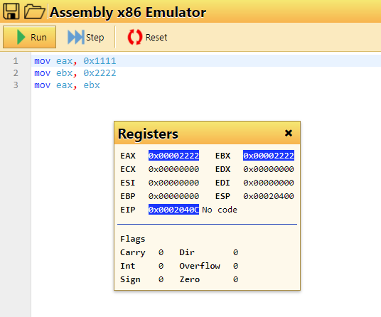

```python
0x2222
```

Flag: `8738`

***

### General : Shift
#### Description

```
mov eax, 0x123
shr eax, 4
shl eax, 8
```

What do you have in EAX after running these instructions? The flag of the format `0x????...` where the number has no leading zeros.

#### Solve

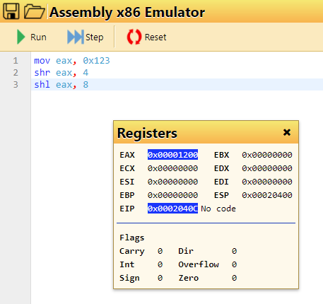

Flag: `0x1200`

***

### General : Assembly: Reset a register
#### Description
To reset (set content value to 0) the register rax , you can do

`move rax, 0x0`

But there is also a more efficient way to do the same. It looks like

`??? rax, rax`

What's the operator mnemonics (instruction) that can set rax to 0?

#### Solve

Googling shows that its `xor`

Flag: `xor`

***

### General : Assembly: Stack (1)
#### Description

```
mov eax, 0x123
mov ebx, 0x321
push eax
add eax, 0x111
mov ebx, eax
pop ebx
```

What's the hex value of ebx at the end? Enter flag in the format of `0x????` where the hex value contains no leading 0s.

#### Solve


Flag: `0x123`

***

### General : Assembly: Stack (2)
#### Description

```
mov eax, 0x123
mov ebx, 0x321
push eax
push ebx
pop eax
pop ebx
```

What's the hex value of ebx at the end? The flag is in the form or '0x???' with no leading 0s.

#### Solve

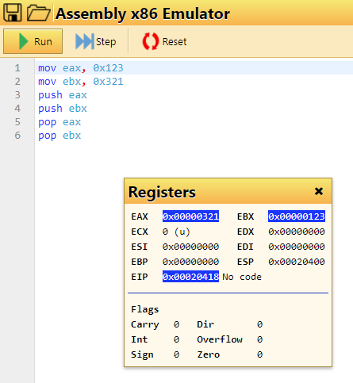

Flag: `0x123`

***

### General : Assembly: Jump
#### Description
There is a bug in this program so it won't compile. Please fix the bug and get the flag.

```
global    start

section   .text
_start:	mov eax, 0x100
	mov ebx, 0x200
	xor ecx, ecx  			; What does this do?
	
	cmp eax, ebx	
	jle label1
	
	cmp eax, 0x100
	je  label2	
	cmp ebx, 0x200
	jne label3  
	mov edx, message1
	jmp print	

label1:
	mov edx, message2
	jmp print	
	
label2:
	mov edx, message3
	jmp print	
label3:
	mov edx, message4
     

print:
        mov       eax, 1                  ; system call for write
        mov       edi, 1                  ; file handle 1 is stdout
        mov       esi, edx                ; address of string to output
        mov       edx, 0x0d               ; number of bytes
        syscall                           ; invoke operating system to do the write

exit:
        mov       rax, 60                 ; system call for exit
        xor       rdi, rdi                ; exit code 0
        syscall                           ; invoke operating system to exit

          section   .data
message1:  db        "fwopCTF{fwee}", 10
message2:  db        "fwopCTF{fwop}", 10
message3:  db        "fwopCTF{flee}", 10
message4:  db        "fwopCTF{foop}", 10
```

#### Solve

Fix the code at line 34

```
-         mov       edx, 0x0?
+         mov       edx, 0x0d
```

Flag: `fwopCTF{fwop}`

***

### General : Go through some gates
#### Description
if A, B, and Cin all equal to 1. What's the value of S?

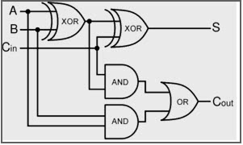

#### Solve
Looking at the diagram the left most XOR gate is not triggered as both A and B are 1. C then triggers the XOR gate of S therefore the value of S is 1.

Flag: `1`

***

### General : Name this language(0)
#### Description

```
#include <stdio.h>
int main() {
   printf("Hello, World!");
   return 0;
}
```

#### Solve

Flag: `c`

***

### General : Name this language(1)
#### Description

```
fn main() {
  println!("Hello World!");
}
```

#### Solve

Flag: `rust`

***

### General : Name this language (2)
#### Description

```
package main
import "fmt"
func main() {
  fmt.Println("hello world")
}
```

#### Solve

Flag: `go`

***

### General : Name this language (3)
#### Description

```
PROGRAM Triangle
 IMPLICIT NONE
 REAL :: a, b, c, Area
 PRINT *, 'Welcome, please enter the&
          &lengths of the 3 sides.'
 READ *, a, b, c
 PRINT *, 'Triangle''s area:  ', Area(a,b,c)
END PROGRAM Triangle
FUNCTION Area(x,y,z)
 IMPLICIT NONE
 REAL :: Area            ! function type
 REAL, INTENT( IN ) :: x, y, z
 REAL :: theta, height
 theta = ACOS((x**2+y**2-z**2)/(2.0*x*y))
 height = x*SIN(theta); Area = 0.5*y*height
END FUNCTION Area
```

#### Solve

Flag: `fortran`

***

### General : Name this language (4)
#### Description

```
IDENTIFICATION DIVISION.
PROGRAM-ID.  FweefwopProgram.

PROCEDURE DIVISION.
DisplayPrompt.
DISPLAY "Fweefwop Wins!".
STOP RUN.
```

#### Solve

Flag: `cobol`

***

### General : Name this language (5)
#### Description

```
(defun fibonacci(n)
  (cond
    ((eq n 1) 0)
    ((eq n 2) 1)
    ((+ (fibonacci (- n 1)) (fibonacci (- n 2))))))))
```

#### Solve

Flag: `lisp`

***

### General : Name this language (6)
#### Description

```
10 LET N=10

20 FOR I=1 TO N

30 PRINT "FweeFwop is FweeFwoping"

40 NEXT I
```

#### Solve

Flag: `basic`

***

### General : Name this language (7)
#### Description

```
size([],0).
size([H|T],N) :- size(T,N1), N is N1+1.
```

#### Solve

Flag: `prolog`

***

### General : Name this language (8)
#### Description

```
let sv (h:t) = p : sv (filter (\x -> x `mod` h /= 0) t) in sv [2..]
```

#### Solve

Flag: `haskell`

***#### Solve
There is 1 or more primes missing from the challenge as `p*q != n`. With this information we can check that the remainder is a prime. If its not we need to factor  but if it is we can use it to get `phi` and decrypt the message.

```python
#!/usr/bin/env python3

from Crypto.Util.number import long_to_bytes
import math

n = 7951018409693161668167285098819306759801615467749983772377532762274564323674475529781135819956076874943220398570628206016160240882619874330243093244936395110045993507712409313429053491882557640392921080389040202564944368311332322835084748219968985945494232530915619964225016803746552927248389191728978163526848645974605789560442463273013903681542284658299342143

p = 1929116635275264735053674741049427216734778196597952692885273974756157874848524489523506992386257196915978454424769273897

q = 1903374449504601072452320486035709413287524054085898117310656797189766004182623359564618504846582607657952100194953437513

e = 65537

c = 5966972166891478943697533397002317526062125536151178353483752855912660840768728401988233413928558098251299119103372377488247940263788187179216261221551423070667612264065068718276490178352621443926803409497199336389072678702084464080895190403103597610490385133200289793164066702537822343346786026894342086902097286424450736331498175097265162507503062204219321005

r = (n//p)//q

assert( n == p*q*r )

phi = math.prod([ i-1 for i in [p,q,r]])
d = pow(e,-1,phi)

pt = pow(c,d,n)

print(long_to_bytes(pt))
```

`r` was the missing prime. 

Flag: `fwopCTF{triple_primes_also_work}`

***

## Forensics 

This series focuses on retrieving data from other data.

***

### Forensics : Alice in Wonderland?
#### Description
Chapter One of Alice in Wonderland we're diving into the rabbit hole.


#### Solve
Running `strings` on the file shows the flag at the end of the file.

```bash
...snip...
]hWP&
jc#k
=7g&
mjx/
s\]|."Ue
\qZf
Here is a flag "fwopCTF{Beneath_the_surface}".
```

Flag: `fwopCTF{Beneath_the_surface}`

***

### Forensics : Just inflate me
#### Description
What's in the file?

[flag.txt.gz](./_file/flag.txt.gz)

#### Solve
Use `zcat` to extract and print in one command

```bash
zcat flag.txt.gz
```

Flag: `fwopCTF{ok_you_found_me}`

***

### Forensics : The Meta Joke
#### Description
The fourth wall shatters, along with your expectations of this problem.

The flag is in the image description. How can you view it?

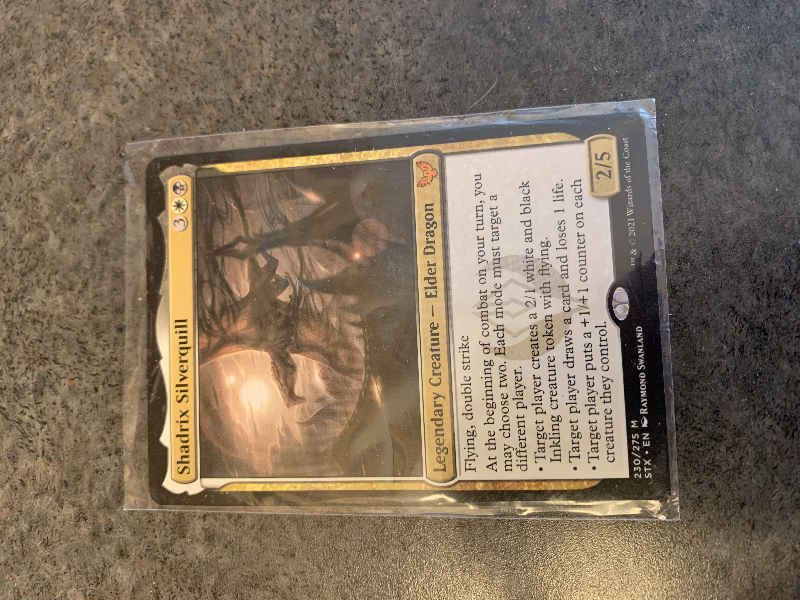

#### Solve
Use `exiftool` to extract and print in one command

```bash
exiftool meta_00.jpg  | grep -i image\ description
```

Flag: `fwopCTF{metadata_is_funky}`

***

### Forensics : Not Viewable
#### Description
Why I don't see anyting useful in this text file?

[fflag_00](./_file/fflag.txt)

#### Solve
Looking at the header of the file we can see that it is infact a PNG file.

```bash 
$ cat fflag.txt | xxd | head 
00000000: 8950 4e47 0d0a 1a0a 0000 000d 4948 4452  .PNG........IHDR
00000010: 0000 0195 0000 0026 0806 0000 000c 7206  .......&......r.
00000020: 5400 0000 0173 5247 4200 aece 1ce9 0000  T....sRGB.......
00000030: 18ca 4944 4154 785e eddd 05d4 6655 d507  ..IDATx^....fU..
00000040: f003 4849 97a4 8484 8020 dda2 80a0 7483  ..HI..... ....t.
00000050: 8128 2dd2 2182 20a2 944a aa74 8774 4a28  .(-.!. ..J.t.tJ(
00000060: 2018 7487 20a1 742a 25a1 1252 aedf fdbe   .t. .t*%..R....
00000070: 3d1c eedc 27de f7b9 6fcc ccdd 6bb1 9899  =...'...o...k...
00000080: e7de 13fb ecb3 ffbb ceb9 637d f0c1 071f  ..........c}....
00000090: a486 1a0e 341c 6838 d070 a0e1 400d 1c18  ....4.h8.p..@...
```

Change the extension and open it with a photo viewer application.

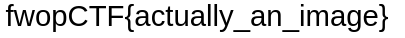
 
Flag: `fwopCTF{actually_an_image}`

***

### Forensics : Reading between the Eyes
#### Description 
Read deep into the eyes, what do you see?


#### Solve
Looking at the metadata for the file with `exiftool` shows nothing.

`strings` also shows nothing of value either.

Analysing with `binwalk` shows no additional data.

Using zsteg finds the flag hidden in byte 1 of the RGB profile working with the least significant bit.

```bash
$ zsteg husky.png 
b1,r,lsb,xy         .. text: "7U>c[rvyzrfM\""
b1,rgb,lsb,xy       .. text: "fwopCTF{r34d1ng_b37w33n_7h3_by73s}/"
b1,abgr,msb,xy      .. text: "[U[wwyUU"
b3,b,lsb,xy         .. text: "?rc%Gw'["
b3,rgb,lsb,xy       .. file: PGP Secret Key -
b3,rgba,lsb,xy      .. file: PGP Secret Key -
b4,r,lsb,xy         .. text: "wxfveD#0"
b4,g,lsb,xy         .. text: "TETETffx"
b4,b,lsb,xy         .. text: "fwvB34\"TC "
b4,rgba,lsb,xy      .. text: "O`/`/q_`O`O_?N/N"
```

Flag: `fwopCTF{r34d1ng_b37w33n_7h3_by73s}`

***

### Forensics : Not the same
#### Description 
They are not the same if you look carefully.

- [file_1](./_file/t1.txt)
- [file_2](./_file/t2.txt)

#### Solve
Reviewing the length of the files they are the same length at 10000 lines each. Running a `diff` between them shows the flag.

```bash
diff -U1 t* | egrep '^-' | cut -d'-' -f2 | tr -d '\n'
```

Flag: `fwopCTF{r3sp3ct_th3_d1ff}`

***

### Forensics : Sharper Image
#### Description 
There is a flag in the file.

- [text](./_file/bb.txt)

#### Solve
The file provided is base64 encoded. Decoding it provides a PNG image. Write the PNG to a file then open it.

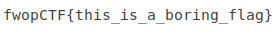

Flag: `fwopCTF{this_is_a_boring_flag}`

***

### Forensics : What's inside of this apple?
#### Description 
What is pictured in the image hidden inside this image?


#### Solve
Using `zsteg -a` provides back a file at the profile `b1,rgb,lsb,xy`.

```bash
$ zsteg -a green_apple.png  
b1,rgb,lsb,xy       .. file: PNG image data, 480 x 66, 8-bit/color RGBA, non-interlaced
b1,rgba,lsb,xy      .. file: PGP Secret Key -
b2,r,msb,xy         .. text: "w_wuWwu_w"
b2,b,msb,xy         .. text: "U]UUuUU]UWU"
...snip...
```

Extract this file

```bash
zsteg --extract=b1,rgb,lsb,xy green_apple.png > green_sub.png
```

The flag is the image.

Flag: `fwopCTF{apple_core_of_course}`

***

### Forensics : Follow the Shiba
#### Description 
Shiba may not tell you the flag, but you can still follow her direction.


#### Solve
Using `zsteg -a` provides back a line with this text 

```
b1,rgb,lsb,xy       .. text: "No flag here, but you can check out https://imgur.com/gallery/jCJcbzZ  "
```

Browsing to that address has another image hosted on that site. Downloading the image with this link for analysis

[https://i.imgur.com/0yEJ1HH.png](https://i.imgur.com/0yEJ1HH.png)

Run this new image through `zsteg -a` to get the flag with profile `b1,rgb,lsb,xy`

Flag: `fwopCTF{steg_is_fun}`

***

### Forensics : Pranked
#### Description 
After killing this guy in minecraft, he sent me this strange link! I can't figure out how to decipher it, can you?

[https://tinyurl.com/easilypranked](https://tinyurl.com/easilypranked)

Remember to put in fwopCTF{} format.

#### Solve
The link eventually, through redirects, takes you to a "Rick-Rolling" (TM pending). 

The flag is the URI (without the leading '/') of the base link.

Flag: `fwopCTF{easilypranked}`

***

### Forensics : What is in this Cookie?
#### Description 
What is in this image?


#### Solve
Using zsteg finds the flag with profile `b1,rgb,lsb,xy`.

Flag: `FwopCTF{ThisIsSoMuchFun}`

***

### Forensics : Apples & Oranges
#### Description 
Apples and __________


#### Solve
Taking the image and running it through `steghide` with the password `oranges` provides `secret.txt`. The password was guessed from the name of the challenge having `oranges` in it but the description missing it. 

```bash
steghide extract -sf apple.jpg 
Enter passphrase: 
wrote extracted data to "secret.txt".
```

Open the file `secret.txt` to view the flag.

Flag: `fwopCTF{which_is_your_favorite}`

***

### Forensics : Wood Door
#### Description 
The message is not carved on the wood. It's deeper in the color.


#### Solve
Assessing the image with tools like `zsteg`, `foremost`, and `binwalk` show nothing. This leads me to believe that it must be something that has edited the actual image itself. 

Using `stegsolve` ([http://www.caesum.com/handbook/Stegsolve.jar](http://www.caesum.com/handbook/Stegsolve.jar)) we are able to view the image in differet ways, includeing bit planes for colours. The place that was hiding the flag was `Blue 2`

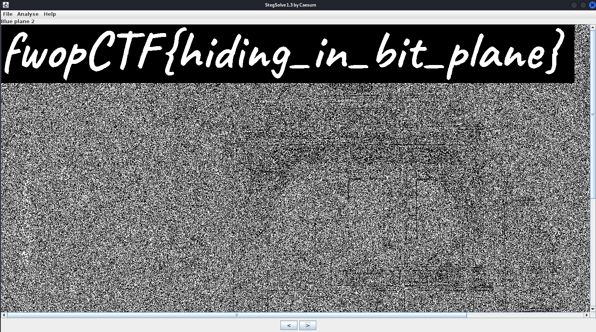

Flag: `fwopCTF{hiding_in_bit_plane}`

***

### Forensics : Corrupted_File
#### Description 
Uncorrupt this file to discover the secret message hidden within.

- [corrupted_flag.png](./_file/corrupted_flag_00.png)

#### Solve
Use `binwalk` on the file to get a `zlib` file.

```bash
binwalk -e corrupted_flag.png
```

Extract the `zlib` archive

```bash
printf "\x1f\x8b\x08\x00\x00\x00\x00\x00" |cat - 5B.zlib |gzip -dc >5B.uncompressed
```

Link to it with the `.data` extension.

```bash
ln -s 5B.uncompressed 5B.data
```

Open with gimp

```bash
gimp 5B.data
```

Adjust the following parameters:

|Image Type|Width|Height|
|-|-|-|
|RGB Alpha|864|500|

This should be the presented picture with the flag present.

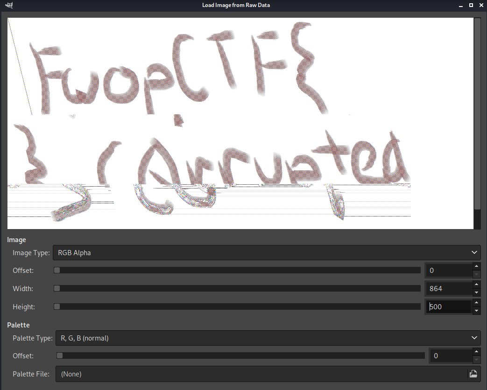

Flag: `fwopCTF{c0rrupted}`

***

### Forensics : Song Naming
#### Description 
I keep hearing this song in some videos, can you help me find the name?

Flag format: fwopCTF{(song name)(song's full artist's name)} Do not put any spaces in the flag.

Example: Whatever It Takes by Imagine Dragons
Flag: fwopCTF{whateverittakesimaginedragons}

[song00](./_audio/song_00.mp3)

#### Solve
Assessing the file there is no metadata found with `exiftool` or `ffmpeg`.

Using shazam and listening to the song provides the information about the track.

Flag: `fwopCTF{shoptobyfox}`

***

### Forensics : Smashed
#### Description 
Our newbie secrete agent doesn't know any encryption. So he just smashed his message and scrumble the pieces, just to fool our enemy. We are not sure it would work, but we need to get the message out anyway. Please help!

[smashed.txt.gz](./_file/smashed.txt.gz)

#### Solve

Split on tuple separators then sort by int then get unique values and finally remove new lines

```bash
$ zcat smashed.txt.gz | sed -E "s/\), \(/\n/g" | sort -k2 -n test | uniq | cut -d"'" -f2 | tr -d '\n'

                            TheFweefwopCyberSecurityTeamishonoredtohaveyouparticipateourfirstCTF.\nWesincerelyhopeyouhadfunandlearnedsomethinguseful.Oh!theflagis\nfwopCTF{kirby_is_the_best_in_super_smash_bros_change_my_mind}
```

Flag: `fwopCTF{kirby_is_the_best_in_super_smash_bros_change_my_mind}`

***

### Forensics : Bitcoin Laundering (0)
#### Description 
Our cyber secret special undercover agent intersepted a cryptocurrency transaction log. The first thing we want to know is how many transactions are there?

[transactions.json.gz](./_file/transactions.json.gz)

#### Solve
Download the file and uncompress.

```bash
gunzip transactions.json.gz
```

The challenge wants the total number of transactions. Can we use `wc` 

```bash 
cat transactions | wc -l
cat transactions | wc -c 
```

No. It returns `0` for lines but `3657079` for characters. Running head with a char limit of 100 returns 

```bash 
$ head -c 100 transactions.json
[{"quantity": 12.53, "src_addr": "1D9Tagw8NWdG63XE5Sy8PsGHxtEyVJWQrg", "dest_addr": "1Q5bKCUoiJqxTaw
```

So it appears that the json is a single line. Okay, lets parse it with python. Creating a pythong script to solve this we can load in json module as we know its json data. Load in the file and count the elements for the flag.

```python
import json

# read in data
data = open('./transactions.json').read()

# parse data as json to object
j = json.loads(data)

# print length
print(len(j))
```

Run the script and the length will be output. Use this length value as the flag. 

This could have also been solved with a single python line or `jq`. 

```bash
# python
python3 -c 'import json; print(len(json.load(open("./transactions.json"))))'

# jq
jq length transactions.json
```

Flag: `20000`

***

### Forensics : Bitcoin Laundering (1)
#### Description 
Use the same log file from `Bitcoin Laundering (0)`.

We are particular interested in an address `16ftSEQ4ctQFDtVZiUBusQUjRrGhM3JYwe`. Could you sum up all the quantity of Bitcoin the address has received (the address as `dest_addr`)?

#### Solve
Following on from the last challenges script we make some modifications to test against the required elements to get a list of elements.

- dest_addr = '16ftSEQ4ctQFDtVZiUBusQUjRrGhM3JYwe'
- currency  = 'Bitcoin'

```python
import json

# read in data
data = open('./transactions.json').read()

# parse data as json to object
j = json.loads(data)

# set target address 
target_addr = '16ftSEQ4ctQFDtVZiUBusQUjRrGhM3JYwe'

# total values
total = 0

# loop over transactions as t
for t in j:
	if t['cryptocurrency'].lower() == 'bitcoin' and t['dest_addr'] == target_addr:
		total += t['quantity']

# print length
print(total)
```

The output is the flag.

This could also be solved with one line of python

```python
sum( [ i['quantity'] for i in json.load(open('./transactions.json')) if i['dest_addr'] == '16ftSEQ4ctQFDtVZiUBusQUjRrGhM3JYwe' and i['cryptocurrency'].lower() == 'bitcoin' ])
```

Flag: `63382.93`

***

### Forensics : Kevin zzZZ
#### Description
Kevin is dreaming


#### Solve
There is a hint on this challenge for a walkinh bin - hinting at the binary `binwalk`.

Using that knowledge we run binwalk on the jpeg

```bash
$ binwalk kevin_zzz.jpg
DECIMAL       HEXADECIMAL     DESCRIPTION
--------------------------------------------------------------------------------
0             0x0             JPEG image data, JFIF standard 1.01
2227057       0x21FB71        PNG image, 1147 x 1147, 8-bit/color RGB, non-interlaced
2227116       0x21FBAC        Zlib compressed data, default compression
2308197       0x233865        JPEG image data, JFIF standard 1.01
```

This shows that there is more than just the image that we can see when opening the file. Lets extract this data

```bash
$ binwalk --dd=".*" kevin_zzz.jpg
```

Next we move into the extracted file directory and check the file types of the extracted data

```bash
$ cd _kevin_zzz.jpg.extracted
$ file *
0:          JPEG image data, JFIF standard 1.01, resolution (DPI), density 72x72, segment length 16, progressive, precision 8, 3024x4032, components 3
21FB71: PNG image data, 1147 x 1147, 8-bit/color RGB, non-interlaced
21FBAC:     empty
21FBAC-0:   zlib compressed data
233865: JPEG image data, JFIF standard 1.01, aspect ratio, density 1x1, segment length 16, baseline, precision 8, 1280x720, components 3
```

There are 2 image files in these extracted files. Lets try renaming these and opening them.

The first image i rename and open is a qrcode. Lets decode with `zbar`

```bash
$ zbarimg 21FB71.png
QR-Code:fwopCTF{rick_fan_are_you_not?}
scanned 1 barcode symbols from 1 images in 0.09 seconds
```

And we have the flag~

Flag: `fwopCTF{rick_fan_are_you_not?}`

***

### Forensics : Noise
#### Description
We intercepted this sound clip. It's not even music. What's in it?

[noise.wav](./_audio/noise_00.wav)

#### Solve
Opening the wav file in `sonic-visualiser` shows the waveform of the file. 

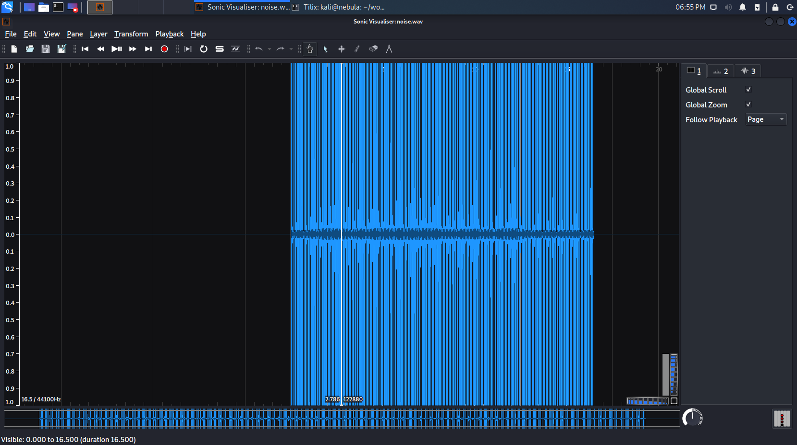

Viewing the spectogram we can see the flag (menu "Layer" > "Add Spectrogram")

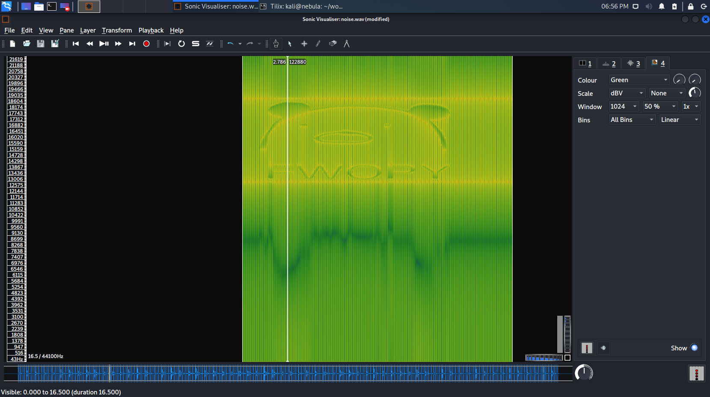

The flag is the name provided

Flag: `FWOPY`

***

## Linux 

This series of challenges focuses on a single remote machine with varying levels similar to overthewire challenges. All challenges required assessing the file system as the level user to find the next users password (which was the flag).

`ssh level0@linux.fweefwop.club`

`pass: fwopCTF{level_0}`

Level users can be logged into with `su - level<number>`

***

### Linux : Level 1
Login to the machine and list the local directory. The flag is the name of an empty file in the home directory.

```bash 
ls fw*
```

Flag: `fwopCTF{level_1_u3xe4}`

***

### Linux : Level 2
Flag is in a sub directory in level1's home

```bash
ls subdir/f*
```

Flag: `fwopCTF{level_2_l46h3}`

***

### Linux : Level 3
Flag is in the file name `flag.txt` (surprisingly)

```bash
cat flag.txt
```

Flag: `fwopCTF{level_3_ti8fx}`

***

### Linux : Level 4
Flag is contained as an the environment variable `FLAG`

```bash
env | grep FLAG=
```

Flag: `fwopCTF{level_4_nmc4e}`

***

### Linux : Level 5
Flag is in a file in a subdirectory

```bash
cat pneumonoultramicroscopicsilicovolcanoconiosis/hippopotomonstrosesquippedaliophobia/really_long_name_so_you_dont_type_it_but_not_long_enough_that_it_obscures_your_screen_and_stuff_lol_I_dont_know_what_to_put_here/flag
```

Flag: `fwopCTF{level_5_4gw}`

***

### Linux : Level 6
This flag tests grep skills 

```bash
cat flag.txt | grep fwop
```

The flag will be roughly 30 words into the line from the command above.

Flag: `fwopCTF{level_6_3bw}`

***

### Linux : Level 7
Flag is in a hidden file (prefixed with `.`)

```bash
cat .flag.txt
```

Flag: `fwopCTF{level_7_82j}`

***

### Linux : Level 8
There is a PNG file listed in the home directory. Inspection of this file shows its a ascii document

```bash
file flag.png
```

The flag can be retrieve like the other files with `cat`

```bash
cat flag.png
```

Flag: `fwopCTF{level_8_2b3}`

***

### Linux : Level 9
The home directory contains two files `f1.txt` and `f2.txt`. If these files are differenced the flag is revealed.

```bash
diff f*.txt
```

Flag: `fwopCTF{level_9_c2p}`

***

### Linux : Level 10
The file `-cant_touch_this` cant be accessed by using `cat` directly due to the `-` being interpreted as an argument to `cat`. To solve this we reference the file by its local path.

```bash
cat ./-cant_touch_this
```

Flag: `fwopCTF{level_10_fqd}`

***

### Linux : Level 11
Reading the readme file in the home directory provides details that the file is on the system somewhere called `level11_flag.txt`. Using this information and `find` the flag can be found.

```bash
find / -name level11_flag.txt -exec cat {} \; 2>/dev/null
```

Flag: `fwopCTF{level_11_87h}`

***

## Crypto

***

### Crypto : Caesar
#### Description

I found this on a ancient scroll dated back to when Caesar was in charge in Rome. What does it say?

_Note: no space in the flag_

`vmefSJV{Rhkjki_iqoi_Suqiuh_iksai}`

#### Solve
The challenge is using a Caesar cipher to obfuscate the flag. 

Dropping the obfuscated flag into cyberchef and using a `Vigenere Decode` with the key `q` provides the flag

<script src="https://asciinema.org/a/14.js" id="asciicast-14" async></script>

Flag: `fwopCTF{Brutus_says_Ceaser_sucks}`

***

### Crypto : Some Ciphers 
#### Description
Use ROT13 to decode this: 

`Hfr Pnrfne Pvcure gb qrpbqr guvf: Oekh vbqw yi: vmefSJV{ckbjy_syfxuh_ixudqdywqdi}`

#### Solve 
As mentioned in the description - using ROT13 to rotate the characters 13 positions shows the flag. This can be done in cyberchef but this solve shows using `tr` to solve.

_Note that this was not a 13 character rotation like the name suggested but instead it was a 10 character rotation._

```bash
printf "vmefSJV{ckbjy_syfxuh_ixudqdywqdi}" | tr 'a-z' 'k-za-j'
```

Flag: `fwopSJV{multi_cipher_shenanigans}`

***

### Crypto : Simple MD5
#### Description
Get the signature of the phrase `Happy as a Clam` using the MD5 hashing algorithm.

#### Solve
As the instructions state - get the MD5 value of the string `Happy as a Clam`.

```bash
printf 'Happy as a Clam' | md5sum
```

Flag: `7ca2197c58b026825c382e32621b1ce4`

***

### Crypto : Oink
#### Description
This cipher is an ancient cipher. What does it say?


#### Solve
Googling for `lines and dots cipher` proves fruitful with an image stating the cipher type as `Pigpen Cipher` fitting the challenge name.

Using a lookup table like the one below the flag can be found. 

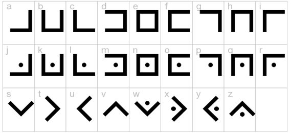

Flag: `fwopCTF{welovepigs}`

***

### Crypto : FlipFwop
#### Description
Leonardo Da Vinci would be proud!

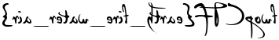

#### Solve
Using any basic image editing software you are able to flip the image on the y-axis to see the flag.

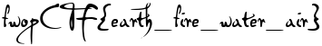

Flag: `fwopCTF{eatch_fire_water_air}`

***

### Crypto : More than 64
#### Description
`Ap8046W?O%DffZ(EaN9aF(KE"GAhV?A7'P!Ebf$(Df9!#Dff?$F`VY32Dfg`

#### Solve
The challenge name suggest higher than 64 - base64. Trying base85 reveals the flag

```python
flag = 'Ap8046W?O%DffZ(EaN9aF(KE"GAhV?A7\'P!Ebf$(Df9!#Dff?$F`VY32Dfg'
print( base64.a85decode(flag) )
```

Flag: `fwopCTF{other_bases_would_work_too_not_just_64}`

***

### Crypto : Samuel Morse
#### Description
I was given this from a man called Samuel Morse: 

`-- --- .-. ... . / -.-. --- -.. . / . .- ... -.--` 

Can you tell me what it is?

_Note: Spaces should be replaced with underscores, don't copy the two double quotes, all of the letters are lowercase(not including fwopCTF)._

#### Solve
Dropping the string into cyberchef and using the morse decode fuction provides the flag. We then add `_` in place of `/` in the original problem and convert to lowercase.

Flag: `fwopCTF{morse_code_easy}`

***

### Crypto : ROT More
#### Description

`7H@Ar%uLC_Ecf0E0:DN`

#### Solve
The other rotational option on cyberchef is `ROT47` which also rotates through uppercase ascii and printable special characters. Using this we can get the flag

Flag: `fwopCTF{r0t47_t_is}`

***

### Crypto : Hebrew Texts
#### Description
I found some scrolls from the Black Sea. I translated the texts from its original Hebrew texts, but they still don't make sense. Can you tell me what they say?

The scrolls' content is

`udlkXGU{gsv_dzgvi_rm_gsv_yozxp_hvz_rh_gll_hzogb_zFwsVFqRsL}`

#### Solve
This is another cipher that is available on cyberchef. Using the Atbash cipher the flag can be found

Flag: `fwopCTF{the_water_in_the_black_sea_is_too_salty_aUdhEUjIhO}`

***

### Crypto : Capture the flags
#### Description
Flags or flag? Can flags make a flag?


#### Solve
Searching for flags with the description of some provided showed maritime flags. We also needed ones with accurate numbers to show the complete flag.

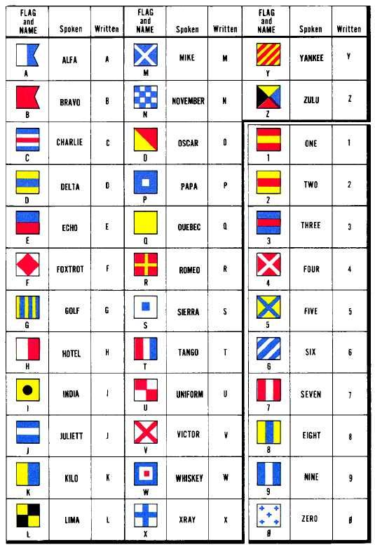

This provides
`eureka8891`

_note: this flag might not be in the right format as i didnt save the original nor can i resubmit to confirm._

Flag: `fwopCTF{eureka8891}`

***

### Crypto : 5x5
#### Description
`21 52 34 35 13 44 21 {35 34 31 54 12 24 45 43 _ 43 41 45 11 42 15}`

Put the `{`, `_`, and `}` where they should be.

#### Solve
This flag is a polybius square. Take the coordinates provided with the no-j type square and solve

| | 1 | 2 | 3 | 4 | 5 |
| --- | --- | --- | --- | --- | --- |
| 1 | A | B | C | D | E |
| 2 | F | G | H | I | K |
| 3 | L | M | N | O | P |
| 4 | Q | R | S | T | U |
| 5 | V | W | X | Y | Z |

Producing a lookup of `FWOPCTFPOLYBIUSSQUARE`

| Lookup | Value |
| --- | --- |
| 21 | F |
| 52 | W |
| 34 | O |
| 35 | P |
| 13 | C |
| 44 | T |
| 21 | F |
| {  | { |
| 35 | P |
| 34 | O |
| 31 | L |
| 54 | Y |
| 12 | B |
| 24 | I |
| 45 | U |
| 43 | S |
| _  | _ |
| 43 | S |
| 41 | Q |
| 45 | U |
| 11 | A |
| 42 | R |
| 15 | E |
| }  | } |


Flag: `fwopCTF{polybius_square}`

***

### Crypto : talking in the wind
#### Description

`TSA-E-DONIN-EE GLOE-IH NE-AHS-JAH NE-ZHONI MOASI D-AH MA-E{MOASI TLO-CHIN BE-TAS-TNI AH-JAH_TSA-E-DONIN-EE AH-LOSZ TLO-CHIN TSIN-TLITI_THAN-ZIE TSE-GAH DZEH_GLOE-IH YEH-HES TSAH LHA-CHA-EH}`

#### Solve
Dropping the entire description ciphertext into google comes back with results for Navajo code. Searching for navajo decoder, decode.fr has a decoder. After inputting the values the flag is provided back. Adjust formatting and submit.

Flag: `fwopCTF{come_from_the_wind}`

***

### Crypto : Did you take biology?
#### Description

`CTA TTA CGG GCG TTA CGT CCG CTC TTA CTC TCA`

#### Solve
Dropping the entire description ciphertext into google comes back with results for DNA RNA rDNA sequences . Searching for rdna decoder, decode.fr has a decoder. After inputting the values the flag is provided back. Adjust formatting and submit.

`D N A R N A G E N E S`

Flag: `fwopCTF{dns_rna_genes}`

***

### Crypto : Touch and feel
#### Description
Can you feel it?

#### Solve
The code is braille. Decode.fr has a decoder. After inputting the values the flag is provided back. Adjust formatting and submit.

`FWOPCTFBRAILEFUN`

Flag: `fwopCTF{braille_fun}`

***

### Crypto : Unbreakable 
#### Description
Here is the longest non-chemistry, non-medical word I know.

`V3Z4bHd2IGdzdiB1bG9vbGRybXQgaGdpcm10CkVUc29SVjFWTUhZbEJDTWxSU0FzeVNFb1JUOW5SU0lsQUhZbnlUVW1SVG9hUldRc04yRXFNcUIwTFd0NE1Xd29NYXA0QmFSNUFHQXJNR1pkQkdVckIyTjJPWFkzekNJbFJUQTN5M1lXRVZBN3VIWXN4bjkxeW5KdHpDSmY=`

#### Solve
I tried this in cyberchef for a few minutes then thought of googling the descriptions first sentence. I landed on `https://irisreading.com/10-longest-words-in-the-english-language/` which had `Antidisestablishmentarianism` for 28 chars which didnt look scientific

Flag: `fwopCTF{antidisestablishmentarianism}`

***

### Crypto : My mind is all blanks
#### Description

So blank! So blank!

#### Solve
This challenge was a bit more interesting that some of the other crypto challenges and im sure it could have been solved in cyberchef but python3 was used. 

The challenge presents us with a seemingly blank file when using `cat` to view it. If we check out the hexidecimal dump of the file we can see that it does have data, just no human readable characters, only `0x09 - tab` and `0x20 - space` characters. The output looks random.

```bash
$ hexdump blanks.txt 
0000000 0909 2020 0909 2009 0909 2020 0909 0909
0000010 0909 2020 0909 0920 0909 0920 2020 0909
0000020 0909 2020 0909 2009 0909 2020 0909 2009
0000030 0909 2020 0920 2009 0909 0920 2020 0909
0000040 0909 2020 0909 2009 0909 2020 0909 2009
0000050 0909 2020 0909 2009 0909 0920 2020 0909
0000060 0909 2020 0909 2009 0909 2020 0909 2009
0000070 0909 2020 0909 0920 0909 0920 2020 0909
0000080 0909 2020 2009 0920 0909 2020 2009 2020
0000090 0909 0920 2020 0909 0909 2020 0920 0909
00000a0 0909 2020 2009 0909 0909 0920 2020 0909
00000b0 0909 2020 2009 2020 0909 2020 0909 0909
00000c0 0909 0920 2020 0909 0909 2020 0909 2009
00000d0 0909 2020 0909 0920 0909 2020 0909 2020
00000e0 0909 0920 2020 0909 0909 2020 0909 2009
00000f0 0909 2020 0909 2009 0909 2020 2009 0920
0000100 0909 0920 2020 0909 0909 2020 0920 2009
0000110 0909 2020 2009 2020 0909 0920 2020 0909
0000120 0909 2020 0920 2009 0909 2020 0920 0909
0000130 0909 0920 2020 0909 0909 2020 0920 2009
0000140 0909 2020 2009 2009 0909 0920 2020 0909
0000150 0909 2020 0909 2009 0909 2020 0909 2009
0000160 0909 2020 2009 0920 0909 0920 2020 0909
0000170 0909 2020 0920 2009 0909 2020 2009 2020
0000180 0909 0920 2020 0909 0909 2020 0909 2009
0000190 0909 2020 0909 2009 0909 2020 0909 0920
00001a0 0909 0920 2020 0909 0909 2020 0920 2009
00001b0 0909 2020 2009 2009 0909 0920 2020 0909
00001c0 0909 2020 0909 2009 0909 2020 0909 2009
00001d0 0909 2020 2009 0920 0909 0920 2020 0909
00001e0 0909 2020 0920 2009 0909 2020 2009 2020
00001f0 0909 0920 2020 0909 0909 2020 0920 2009
0000200 0909 2020 0920 0909 0909 0920 2020 0909
0000210 0909 2020 0920 2009 0909 2020 2009 2009
0000220 0909 0920 2020 0909 0909 2020 0909 2009
0000230 0909 2020 0909 2009 0909 2020 2009 0920
0000240 0909 0920 2020 0909 0909 2020 0909 2009
0000250 0909 2020 0909 2009 0909 2020 0909 2009
0000260 0909 0920 2020 0909 0909 2020 0909 2009
0000270 0909 2020 0909 2009 0909 2020 0909 0920
0000280 0909 0920 2020 0909 0909 2020 0909 2009
0000290 0909 2020 0909 0920 0909 2020 2009 2009
```

If we look at it with `xxd` it shows the interpreted ascii data as well

```bash
$ xxd blanks.txt 
00000000: 0909 2020 0909 0920 0909 2020 0909 0909  ..  ... ..  ....
00000010: 0909 2020 0909 2009 0909 2009 2020 0909  ..  .. ... .  ..
00000020: 0909 2020 0909 0920 0909 2020 0909 0920  ..  ... ..  ... 
00000030: 0909 2020 2009 0920 0909 2009 2020 0909  ..   .. .. .  ..
00000040: 0909 2020 0909 0920 0909 2020 0909 0920  ..  ... ..  ... 
00000050: 0909 2020 0909 0920 0909 2009 2020 0909  ..  ... .. .  ..
00000060: 0909 2020 0909 0920 0909 2020 0909 0920  ..  ... ..  ... 
00000070: 0909 2020 0909 2009 0909 2009 2020 0909  ..  .. ... .  ..
00000080: 0909 2020 0920 2009 0909 2020 0920 2020  ..  .  ...  .   
00000090: 0909 2009 2020 0909 0909 2020 2009 0909  .. .  ....   ...
000000a0: 0909 2020 0920 0909 0909 2009 2020 0909  ..  . .... .  ..
000000b0: 0909 2020 0920 2020 0909 2020 0909 0909  ..  .   ..  ....
000000c0: 0909 2009 2020 0909 0909 2020 0909 0920  .. .  ....  ... 
000000d0: 0909 2020 0909 2009 0909 2020 0909 2020  ..  .. ...  ..  
000000e0: 0909 2009 2020 0909 0909 2020 0909 0920  .. .  ....  ... 
000000f0: 0909 2020 0909 0920 0909 2020 0920 2009  ..  ... ..  .  .
00000100: 0909 2009 2020 0909 0909 2020 2009 0920  .. .  ....   .. 
00000110: 0909 2020 0920 2020 0909 2009 2020 0909  ..  .   .. .  ..
00000120: 0909 2020 2009 0920 0909 2020 2009 0909  ..   .. ..   ...
00000130: 0909 2009 2020 0909 0909 2020 2009 0920  .. .  ....   .. 
00000140: 0909 2020 0920 0920 0909 2009 2020 0909  ..  . . .. .  ..
00000150: 0909 2020 0909 0920 0909 2020 0909 0920  ..  ... ..  ... 
00000160: 0909 2020 0920 2009 0909 2009 2020 0909  ..  .  ... .  ..
00000170: 0909 2020 2009 0920 0909 2020 0920 2020  ..   .. ..  .   
00000180: 0909 2009 2020 0909 0909 2020 0909 0920  .. .  ....  ... 
00000190: 0909 2020 0909 0920 0909 2020 0909 2009  ..  ... ..  .. .
000001a0: 0909 2009 2020 0909 0909 2020 2009 0920  .. .  ....   .. 
000001b0: 0909 2020 0920 0920 0909 2009 2020 0909  ..  . . .. .  ..
000001c0: 0909 2020 0909 0920 0909 2020 0909 0920  ..  ... ..  ... 
000001d0: 0909 2020 0920 2009 0909 2009 2020 0909  ..  .  ... .  ..
000001e0: 0909 2020 2009 0920 0909 2020 0920 2020  ..   .. ..  .   
000001f0: 0909 2009 2020 0909 0909 2020 2009 0920  .. .  ....   .. 
00000200: 0909 2020 2009 0909 0909 2009 2020 0909  ..   ..... .  ..
00000210: 0909 2020 2009 0920 0909 2020 0920 0920  ..   .. ..  . . 
00000220: 0909 2009 2020 0909 0909 2020 0909 0920  .. .  ....  ... 
00000230: 0909 2020 0909 0920 0909 2020 0920 2009  ..  ... ..  .  .
00000240: 0909 2009 2020 0909 0909 2020 0909 0920  .. .  ....  ... 
00000250: 0909 2020 0909 0920 0909 2020 0909 0920  ..  ... ..  ... 
00000260: 0909 2009 2020 0909 0909 2020 0909 0920  .. .  ....  ... 
00000270: 0909 2020 0909 0920 0909 2020 0909 2009  ..  ... ..  .. .
00000280: 0909 2009 2020 0909 0909 2020 0909 0920  .. .  ....  ... 
00000290: 0909 2020 0909 2009 0909 2020 0920 0920  ..  .. ...  . . 
```

With this information i tried a morse decoder and it was just rubbish. Moving forward i thought that since there are 2 states like binary, lets try and interpret that. 

```python
>>> data = open('./blanks.txt','rb').read()
>>> data
b'\t\t  \t\t\t \t\t  \t\t\t\t\t\t  \t\t \t\t\t \t  \t\t\t\t  \t\t\t \t\t  \t\t\t \t\t   \t\t \t\t \t  \t\t\t\t  \t\t\t \t\t  \t\t\t \t\t  \t\t\t \t\t \t  \t\t\t\t  \t\t\t \t\t  \t\t\t \t\t  \t\t \t\t\t \t  \t\t\t\t  \t  \t\t\t  \t   \t\t \t  \t\t\t\t   \t\t\t\t\t  \t \t\t\t\t \t  \t\t\t\t  \t   \t\t  \t\t\t\t\t\t \t  \t\t\t\t  \t\t\t \t\t  \t\t \t\t\t  \t\t  \t\t \t  \t\t\t\t  \t\t\t \t\t  \t\t\t \t\t  \t  \t\t\t \t  \t\t\t\t   \t\t \t\t  \t   \t\t \t  \t\t\t\t   \t\t \t\t   \t\t\t\t\t \t  \t\t\t\t   \t\t \t\t  \t \t \t\t \t  \t\t\t\t  \t\t\t \t\t  \t\t\t \t\t  \t  \t\t\t \t  \t\t\t\t   \t\t \t\t  \t   \t\t \t  \t\t\t\t  \t\t\t \t\t  \t\t\t \t\t  \t\t \t\t\t \t  \t\t\t\t   \t\t \t\t  \t \t \t\t \t  \t\t\t\t  \t\t\t \t\t  \t\t\t \t\t  \t  \t\t\t \t  \t\t\t\t   \t\t \t\t  \t   \t\t \t  \t\t\t\t   \t\t \t\t   \t\t\t\t\t \t  \t\t\t\t   \t\t \t\t  \t \t \t\t \t  \t\t\t\t  \t\t\t \t\t  \t\t\t \t\t  \t  \t\t\t \t  \t\t\t\t  \t\t\t \t\t  \t\t\t \t\t  \t\t\t \t\t \t  \t\t\t\t  \t\t\t \t\t  \t\t\t \t\t  \t\t \t\t\t \t  \t\t\t\t  \t\t\t \t\t  \t\t \t\t\t  \t \t '
```

Could this be a visual thing based on alignment of the 2 states output? Perhaps, but i wasnt going to go down that rabbit hole yet. 

Next we converted the 2 states to `1` and `0`. The order i tried was random and my plan was to try switching the `1` and `0` replace values if the first attempt failed.

```python
>>> d2 = data.replace(b'\x20',b'1').replace(b'\x09',b'0')
>>> d2
b'001100010011000000110010001011000011000100110001001110010010110000110001001100010011000100101100001100010011000100110010001011000011011000110111001011000011100000110100001011000011011100110000001011000011000100110010001100110010110000110001001100010011011000101100001110010011011100101100001110010011100000101100001110010011010100101100001100010011000100110110001011000011100100110111001011000011000100110001001100100010110000111001001101010010110000110001001100010011011000101100001110010011011100101100001110010011100000101100001110010011010100101100001100010011000100110110001011000011000100110001001100010010110000110001001100010011001000101100001100010011001000110101'
```

Next was to try to get this to a string

```python
>>> from Crypto.Util.numbers import long_to_bytes
>>>
>>> int(d2,2)
3765118332785218421457258987321597315056836535604587623788012572542576781794538604676925047186328986272806735544382160348707527231920576986026156457339138356478169306384733733802696742221179227173106229
>>>
>>> long_to_bytes(int(d2,2))
b'102,119,111,112,67,84,70,123,116,97,98,95,116,97,112,95,116,97,98,95,116,111,112,125'
```

Great! we have what appears to be ascii chars with `102=f` and `119=w`. This was enough for me to think we had the flag. Lets put it together

```python
>>> ''.join([ chr(int(i)) for i in long_to_bytes(int(d2,2)).decode().split(',') ])
'fwopCTF{tab_tap_tab_top}'
```

Flag: `fwopCTF{tab_tap_tab_top}`

***

### Crypto : This is just ridiculous!
#### Description 
Call the Chef!

```
MDEwMDExMTAgMDEwMTAxMTEgMDEwMDAxMDEgMDExMDAxMTEgMDEwMDExMTAgMDExMDExMDEgMDEwMTAxMDEgMDExMDAxMTEgMDEwMDExMTAgMDExMDEwMTAgMDEwMTAwMDEgMDExMDAxMTEgMDEwMDExMTAgMDExMTEwMTAgMDEwMTEwMDEgMDExMDAxMTEgMDEwMDExMTAgMDExMDEwMTAgMDEwMDExMDEgMDExMDAxMTEgMDEwMDExMTAgMDEwMDAxMDAgMDEwMTAxMDEgMDExMDAxMTEgMDEwMDExMTAgMDEwMDAxMTEgMDEwMTAxMDEgMDExMDAxMTEgMDEwMDExMTAgMDEwMTAxMDAgMDEwMTAxMDEgMDExMDAxMTEgMDEwMDExMTAgMDEwMTAxMDAgMDEwMDEwMDEgMDExMDAxMTEgMDEwMDExMTAgMDExMDExMDEgMDEwMTAxMDEgMDExMDAxMTEgMDEwMDExMTAgMDExMTEwMTAgMDEwMTAwMDEgMDExMDAxMTEgMDEwMDExMTAgMDAxMTAwMTAgMDEwMDAxMDEgMDExMDAxMTEgMDEwMDExMTAgMDExMDEwMTAgMDEwMDEwMDEgMDExMDAxMTEgMDEwMDExMDEgMDExMTEwMTAgMDEwMDAxMDEgMDExMDAxMTEgMDEwMDExMDEgMDExMTEwMTAgMDExMDEwMTEgMDExMDAxMTEgMDEwMDExMTAgMDExMTEwMTAgMDEwMTAwMDEgMDExMDAxMTEgMDEwMDExMTAgMDEwMTAxMDAgMDExMDEwMTEgMDExMDAxMTEgMDEwMDExMTAgMDEwMTAxMDAgMDExMDAwMTEgMDExMDAxMTEgMDEwMDExMDEgMDExMTEwMTAgMDEwMTAxMDEgMDExMDAxMTEgMDEwMDExMDEgMDExMTEwMTAgMDEwMTAxMDEgMDExMDAxMTEgMDEwMDExMTAgMDEwMTAxMDAgMDExMDAxMTEgMDExMDAxMTEgMDEwMDExMDEgMDExMTEwMTAgMDEwMDExMDEgMDExMDAxMTEgMDEwMDExMTAgMDEwMDAxMTEgMDEwMTAxMDEgMDExMDAxMTEgMDEwMDExMDEgMDExMTEwMTAgMDEwMDAwMDEgMDExMDAxMTEgMDEwMDExMTAgMDEwMTAxMTEgMDEwMDAxMDEgMDExMDAxMTEgMDEwMDExMTAgMDEwMTAxMDAgMDExMDAxMTEgMDExMDAxMTEgMDEwMDExMTAgMDEwMDAxMDAgMDEwMDEwMDEgMDExMDAxMTEgMDEwMDExMTAgMDAxMTAwMTAgMDEwMDAxMDEgMDExMDAxMTEgMDEwMDExMTAgMDExMDEwMTAgMDEwMTEwMDEgMDExMDAxMTEgMDEwMDExMTAgMDEwMTAxMDAgMDEwMDAxMDEgMDExMDAxMTEgMDEwMDExMDEgMDAxMTAwMTAgMDEwMTAwMDEgMDExMDAxMTEgMDEwMDExMDEgMDAxMTAwMTAgMDEwMTAwMDEgMDAxMTExMDE=
```

#### Solve
As the name implies using cyberchef, i loaded the data into cyberchef. The end of the data had a `=` which hinted to base64 encoding. Base64 decoding the text provided

```
01001110 01010111 01000101 01100111 01001110 01101101 01010101 01100111 01001110 01101010 01010001 01100111 01001110 01111010 01011001 01100111 01001110 01101010 01001101 01100111 01001110 01000100 01010101 01100111 01001110 01000111 01010101 01100111 01001110 01010100 01010101 01100111 01001110 01010100 01001001 01100111 01001110 01101101 01010101 01100111 01001110 01111010 01010001 01100111 01001110 00110010 01000101 01100111 01001110 01101010 01001001 01100111 01001101 01111010 01000101 01100111 01001101 01111010 01101011 01100111 01001110 01111010 01010001 01100111 01001110 01010100 01101011 01100111 01001110 01010100 01100011 01100111 01001101 01111010 01010101 01100111 01001101 01111010 01010101 01100111 01001110 01010100 01100111 01100111 01001101 01111010 01001101 01100111 01001110 01000111 01010101 01100111 01001101 01111010 01000001 01100111 01001110 01010111 01000101 01100111 01001110 01010100 01100111 01100111 01001110 01000100 01001001 01100111 01001110 00110010 01000101 01100111 01001110 01101010 01011001 01100111 01001110 01010100 01000101 01100111 01001101 00110010 01010001 01100111 01001101 00110010 01010001 00111101
```

Using `from binary`

```
NWEgNmUgNjQgNzYgNjMgNDUgNGUgNTUgNTIgNmUgNzQgN2EgNjIgMzEgMzkgNzQgNTkgNTcgMzUgMzUgNTggMzMgNGUgMzAgNWEgNTggNDIgN2EgNjYgNTEgM2QgM2Q=
```

Again, an `=` sign indicates base64. Decode

```
5a 6e 64 76 63 45 4e 55 52 6e 74 7a 62 31 39 74 59 57 35 35 58 33 4e 30 5a 58 42 7a 66 51 3d 3d
```

Hex. Decode it

```
ZndvcENURntzb19tYW55X3N0ZXBzfQ==
```

Base64 again. Decode it

```
fwopCTF{so_many_steps}
```

Now we have the flag.

Flag: `fwopCTF{so_many_steps}`

***

### Crypto : Ballyshannon
#### Description
If you did a time travel to Ballyshannon, the year is 500CE...

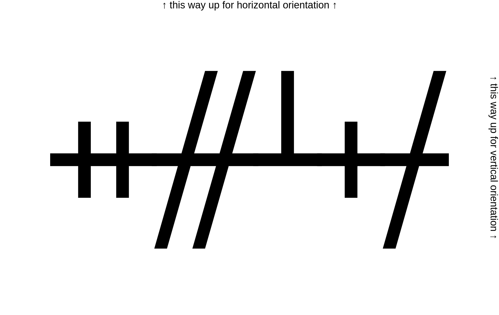

#### Solve
Looking at google images with a search term of `cipher lines crossing line` gave me this image

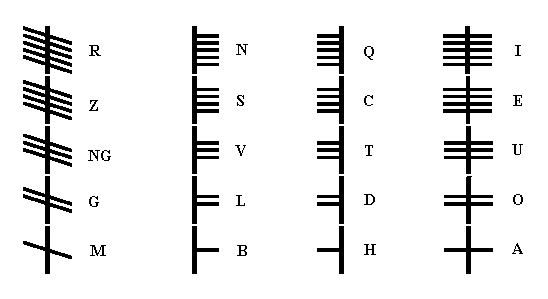

Use it to decipher the message.

_note: no fwoctf{} on this one (even though not specified)_

Flag: `OGHAM`

***

### Crypto : Borg 
#### Description
Borg can never coexist with humans. They are mutually eXclusive to each OtheR.

Captain Jean-Luc Picard received a message from an unknown source.

```
cc dd c5 da e9 fe ec d1 d8 cf d9 c3 d9 de cb c4 c9 cf f5 c3 d9 f5 cc df de c3 c6 cf d7
```

The Enterprise also intercepted an image from the same source.

What does the message say?


#### Solve
This challenge was meant to have users use the resistor color coding to get the XOR key to decrypt the message but loading the hex into cyberchef, using `from hex` then using `XOR Brute Force` shows the flag with key `aa`.

```
...snip...
Key = a4: hya~MZHu|k}g}zo`mkQg}Qh{zgbks
Key = a5: ix`.L[It}j|f|{naljPf|Piz{fcjr
Key = a6: j{c|OXJw~i.e.xmboiSe.Sjyxe`iq
Key = a7: kzb}NYKv.h~d~ylcnhRd~Rkxydahp
Key = a8: dumrAVDypgqkqvclag]kq]dwvkng.
Key = a9: etls@WExqfpjpwbm`f\jp\evwjof~
Key = aa: fwopCTF{resistance_is_futile}
Key = ab: gvnqBUGzsdrhru`obd^hr^gtuhmd|
Key = ac: `qivER@}tcuourghecYouY`srojc{
Key = ad: aphwDSA|ubtntsfidbXntXarsnkbz
Key = ae: bsktGPB.vawmwpejga[mw[bqpmhay
Key = af: crjuFQC~w`vlvqdkf`ZlvZcpqli`x
Key = b0: |mujYN\ah.isin{ty.EsiE|onsv.g
...snip...
```

_Note: the `crib` value can be set to `fwopCTF` to get the value quicker._

Flag: `fwopCTF{resistance_is_futile}`

***

### Crypto : Elementary, My Dear Watson
#### Description
I was reading The Adventure of the Dancing Men when this picture fell out. I really want to know what this says, but dancing men means nothing to me.

_Note: You will need to wrap the flag with fwopCTF{}. If the solution is "Happygator_is_bald", the flag will be "fwopCTF{Happygator_is_bald}" Slashes represent spaces, but in the flag it should be underscores._

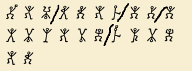

#### Solve 
Googling `dancing men cipher` leads me to `https://www.dcode.fr/dancing-men-cipher`. Use it to decode the message

`You/know/my/methods/Watson`

Flag: `fwopCTF{You_know_my_methods_Watson}`

***

### Crypto : Beep Boop
#### Description
What is that infernal noise? It came over my telegraph.

[Beep-Boop.wav](./_audio/beep_boop_00.png)

#### Solve 
The file provided is an audio file. Listening to the file it contains short and long 'beeping' tones. A quick google of 'short and long tones cipher' reveals that it is morse code. 

Googling a website to decode this come back with `https://morsecode.world/international/decoder/audio-decoder-adaptive.html`

Upload the `.wav` file and play at a rate of 30 WPM decodes

`FWOPCTFBEEPBEEPIMASHEEP2849`

Flag: `fwopCTF{beep_beep_im_a_sheep_2849}`

***

### Crypto : Home Run
#### Description
How many bases must newbies walk down Before you call them hackers?

How many time must you call the chef Before you get to the flag?

The answer, my friend, is blowin' in the wind The answer is blowin' in the wind

```
VFVSQmVFMVVRWGhOUkVGM1RWUkZkMDFFUlhkTlJFRjNUVlJGZDAxVVFYaE5SRVY0VFVSQmQwMUVSWGROUkVWNFRVUkJlRTFVUVhkTlZFVjNUVVJGZUUxRVFYaE5WRUY0VFVSRmQwMUVSWGhOUkVWNFRWUkJkMDFVUlhkTlJFVjRUVVJCZUUxVVFYaE5WRUYzVFVSRmVFMUVRWGhOVkVGM1RWUkZkMDFVUVhkTlJFRjRUVlJCZUUxRVFYZE5SRVY0VFVSQmVFMVVRWGROVkVWM1RWUkJkMDFFUVhoTlZFRjRUVVJCZDAxRVJYaE5SRVYzVFVSQmVFMVVRWGROUkVWM1RVUkJlRTFVUVhoTlJFVjNUVVJGZUUxRVFYaE5SRUYzVFZSRmQwMVVRWGROUkVGNFRWUkJlRTFFUVhkTlJFVjRUVVJGZDAxRVFYZE5WRVY0VFVSQmQwMUVRWGhOVkVGNFRVUkZkMDFFUlhoTlJFVjRUVlJCZDAxVVJYZE5SRVY0VFVSQmVFMVVRWGhOUkVGM1RVUkZlRTFFUlhkTlZFRjNUVlJGZDAxVVFYZE5SRUY0VFZSQmVFMUVSWGROUkVWNFRVUkZlRTFFUVhkTlZFVjNUVlJCZDAxRVJYaE5SRUY0VFVSRmQwMUVSWGhOUkVWM1RWUkJlRTFVUVhkTlJFRjRUVVJCZUUxVVFYaE5SRVYzVFVSRmVFMVVRWGROUkVGM1RWUkZkMDFVUVhkTlJFRjRUVlJCZUUxVVJYZE5SRVY0VFVSRmQwMVVRWGROVkVWM1RVUkZlRTFFUVhoTlZFRjNUVlJGZDAxRVJYaE5SRUY0VFZSQmQwMVVSWGROVkVGNFRVUkJlRTFVUVhoTlJFRjNUVVJGZUUxRVJYZE5SRUYzVFZSRmVFMUVRWGROUkVGNFRWUkJlRTFFUVhkTlZFVjNUVVJCZUUxVVFYZE5WRVYzVFVSRmVFMUVRWGhOVkVGNFRVUkZkMDFFUlhoTlJFVjNUVlJCZDAxVVJYZE5SRUY0VFVSQmVFMVVRWGhOUkVWM1RVUkZlRTFVUVhkTlJFRjNUVlJGZDAxVVFYZE5SRUY0VFZSQmVFMUVSWGROUkVWNFRVUkJlRTFVUVhkTlZFVjNUVVJGZUUxRVFYaE5WRUYzVFZSRmQwMUVSWGhOUkVGNFRWUkJkMDFVUlhkTlZFRjRUVVJCZUUxVVFYaE5WRUYzVFVSRmVFMUVSWGROUkVGNFRWUkJkMDFVUVhoTlJFRjRUVlJCZUUxRVJYZE5WRVYzVFVSQmQwMVVRWGROVkVWM1RWUkJlRTFFUVhoTlZFRjNUVlJGZDAxRVJYaE5SRVYzVFVSQmQwMVVSWGROVkVWM1RVUkJlRTFVUVhkTlZFVjNUVVJGZUUxRVJYaE5SRUYzVFZSRmQwMUVSWGhOUkVGNFRWUkJlRTFFUlhkTlJFVjRUVVJGZDAxRVFYZE5WRVYzVFZSQmQwMUVRWGhOVkVGNFRVUkJkMDFFUlhoTlZFRjNUVlJCZDAxVVJYZE5WRUYzVFVSRmVFMUVRWGhOUkVGM1RVUkZlRTFFUlhkTlZFRjNUVlJGZDAxVVJYZE5SRUY0VFZSQmVFMUVSWGROUkVWNFRVUkJkMDFFUVhkTlZFVjNUVlJCZUUxRVFYaE5WRUY0VFZSRmQwMUVSWGhOUkVWM1RVUkJkMDFVUlhkTlZFRjRUVVJCZUUxVVFYaE5SRVYzVFVSRmVFMVVRWGROVkVGM1RWUkZkMDFVUVhkTlJFVjRUVVJCZDAxVVJYZE5SRVY0VFVSRmQwMVVRWGROVkVWM1RWUkJkMDFFUVhoTlZFRjRUVVJCZDAxVVJYZE5SRVYzVFVSQmQwMVVSWGROVkVGNFRVUkJlRTFVUVhoTlZFRjNUVVJGZUUxRVJYZE5WRUY0VFZSQmQwMUVRWGhOUkVGNFRWUkJlRTFFUlhkTlJFVjRUVVJGZUUxRVFYZE5WRVYzVFVSRmVFMUVRWGhOVkVGNFRWUkJkMDFFUlhoTlJFVjNUVVJCZUUxVVFYZE5WRUY0VFVSQmVFMVVRWGhOUkVGM1RVUkZlRTFFUVhoTlJFRjNUVlJGZDAxVVFYaE5SRUY0VFZSQmVFMVVRWGROUkVWNFRVUkZkMDFFUVhkTlZFVjNUVlJGZUUxRVFYaE5WRUY0VFVSRmQwMUVSWGhOVkVGM1RWUkJkMDFVUlhkTlJFVjRUVVJCZUUxVVFYZE5WRVYzVFVSRmVFMUVSWGROVkVGM1RWUkZkMDFVUVhkTlJFRjRUVlJCZUUxRVJYZE5SRVY0VFVSQmQwMVVRWGROVkVWM1RWUkJkMDFFUlhoTlJFRjRUVlJCZDAxRVJYaE5SRVYzVFVSQmVFMVVRWGROUkVWNFRVUkJlRTFVUVhkTlZFVjNUVVJGZUUxRVJYZE5VVDA5
```

#### Solve 
Using cyberchef with the provided text as input then following the sequence below to get the flag.

`from base64` -> `from base64` -> `from base64` -> `from binary` -> `from hex` -> `from base32`

Flag: `fwopCTF{running_around_the_bases_456789}`

***

### Crypto : Ave Maria
#### Description

No need for wrapper for this problem.


```
Immortalis magnus
Clemens incompraehensibilis
Rex conctipotens
Gloriosus misericors
Fabricator illustrator
Clemens pacificus
Iudex rex
```

#### Solve
Googling the first line with 'cipher' on the end takes us to the `decode.fr` page for the `Trithemius Ave Maria` substitution cipher.

Drop the ciphertext into the input and decrypt the message

`LEARNYOURLATIN`

Flag: `learnyourlatin`

***

### Crypto : 2B, or not 2B!
#### Description

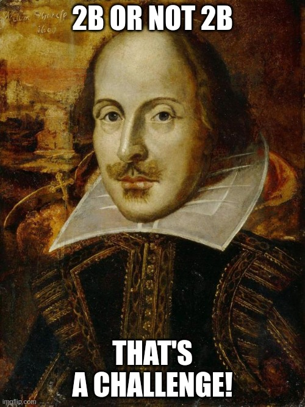

```
2b2b2b2b2b2b2b2b2b2b5b3e2b3e2b2b2b3e2b2b2b2b2b2b2b3e2b2b2b2b2b2b2b2b2b2b3c3c3c3c2d5d3e3e3e3e2b2b2e2b2b2b2b2b2b2b2b2b2b2b2b2b2b2b2b2b2e2d2d2d2d2d2d2d2d2e2b2e3c2d2d2d2e2b2b2b2b2b2b2b2b2b2b2b2b2b2b2b2b2b2e2d2d2d2d2d2d2d2d2d2d2d2d2d2d2e3e2b2b2b2b2b2b2b2b2b2b2b2e3c2b2b2b2b2b2b2b2b2b2b2b2b2b2e3e2d2d2d2d2d2d2d2d2d2d2d2d2e2d2d2e2d2d2d2d2d2d2d2d2e2b2b2b2b2b2b2b2b2b2b2b2b2b2b2b2e2d2d2d2d2d2d2d2d2d2d2d2d2e2b2e2b2b2b2b2b2e2d2d2d2d2d2d2d2e2d2d2d2d2d2d2d2d2e2b2b2b2b2b2b2b2b2b2b2e2b2b2b2b2b2b2b2b2b2b2e3c2b2b2b2b2b2b2b2b2b2b2b2b2e3e2d2e2d2d2d2e2b2b2b2b2b2e2e3c2b2b2b2b2b2b2e3e2d2d2d2d2d2d2e3c2d2d2d2d2d2d2e3e2d2d2d2d2d2e2b2b2b2b2b2e3c2e3e2b2b2b2b2b2b2e3c2b2b2b2b2b2b2b2b2b2e2d2d2d2e2d2d2d2d2d2d2e3e2d2e2b2e3c2b2b2e3e2e3c2b2b2b2b2e2d2d2d2d2d2d2e3e2d2d2d2d2d2e3c2b2b2b2b2b2b2b2e2d2d2d2d2d2d2d2e2d2d2d2d2d2d2d2d2d2d2d2d2d2d2d2d2d2d2d2d2d2d2d2d2d2d2d2e3e2d2d2d2d2d2d2d2d2d2d2e2b2b2b2b2b2b2b2b2b2e2d2e2d2d2d2d2d2d2d2d2d2d2d2d2e2b2b2b2b2b2b2b2b2b2b2b2b2b2b2b2b2b2e2d2d2d2d2d2d2d2e2b2b2b2b2b2b2b2b2b2b2b2b2b2b2b2b2b2b2e
```

#### Solve

The data is hex encoded. If we decode it with pwntools using `pwn unhex <input>` we get a combination of `+-.[]<>`. A small bit of research leads to explain that this is the esoteric language called `brainfuck`.

Using decode.fr's decode tool the flag can be retrieved.

[https://www.dcode.fr/brainfuck-language](https://www.dcode.fr/brainfuck-language)

Flag: `fwopCTF{Something_is_rotten_in_the_state_of_Denmark}`

***

### Crypto : Silly Secret Sharing (SSS)
#### Description
You and your 2 "business" partners (more like partners in crime) want to share a secret pin number for a treasure vault. But you guys decided that no single person can just open the vault. At least 2 people need to agree in order to open the vault. You lookup a handbook on cryptography and found a scheme called [Shamir’s Secret Sharing](https://qvault.io/cryptography/shamirs-secret-sharing/), you all agree to use it. You don't quite understand the part about Finite Field, but you think you don't really need it.

So you produced 3 shares of integer pairs, each of you hold one. Your piece is

`(20, 161013)`

Finally, one day another partner and you decided to open the vault. Her share is

`(10, 122673)`

What's the pin number?

#### Solve
There is python code on the wiki page provided. Use this and change the following diff over the main function

```python
@@ -95,12 +57,7 @@
     return _lagrange_interpolate(0, x_s, y_s, prime)

 def main():
-    """Main function"""
-    secret = 1234
-    shares = make_random_shares(secret, minimum=3, shares=6)
-
-    print('Secret:                                                     ',
-          secret)
+    shares= [(20, 161013),(10, 122673)]
     print('Shares:')
     if shares:
         for share in shares:
@@ -108,8 +65,6 @@

     print('Secret recovered from minimum subset of shares:             ',
           recover_secret(shares[:3]))
-    print('Secret recovered from a different minimum subset of shares: ',
-          recover_secret(shares[-3:]))

 if __name__ == '__main__':
     main()
```

Run and you will get the original key

Flag: `84333`

***

### Crypto : Open Secret!
#### Description
You want to talk to your undercover agent. However, you know your communicate with her is tapped by your nemesis, down to every bit. You have to find a smart way to communicate. You could use RSA, but by now you probably know RSA encrypting and decrypting are not very easy, both sides have to calculate high powers of large numbers. In comparison, you'd prefer to share a key with your agent so she can do XOR decoding for all the messages.

Your agent found this method called Diffie Hellman Key Exchange. So she sent over the following

```
p = 824717393
g = 150357959
A = 734947628

send me B
```

You picked a number `b=845023462`, then compute

```
B = pow(g, b, p) = 286721959
```

You sent `B` to your agent.

Then your agent sent you this

```
T6ZBVGqFaF9gjkhLXL9Ke125S3tIvUdBR45GTVqOQEVEtHFNWo5eRVy9Uw==
```

What does it say?

#### Solve
We have the private component of our key `b`, the modulus `p` and the remote agents public component `A`. Using this information we cat get the shared secret and convert it to bytes. 

```python
# get s as int
s = pow(A,b,p)

# get s as bytes
# this method requires trial and error to get the right length '4'
sbytes = s.to_bytes(4,byteorder='big')

# or we can use pycryptos long_to_bytes
sbytes = long_to_bytes(s)
```

now we have the shared secret we can XOR the data provided with the secret to get the flag

```python
agent_data = 'T6ZBVGqFaF9gjkhLXL9Ke125S3tIvUdBR45GTVqOQEVEtHFNWo5eRVy9Uw=='
data = base64.b64decode(agent_data)

''.join([ chr(data[i] ^ sbytes[i%len(sbytes)]) for i in range(len(data)) ])
```

The complete script 

```python3 
from Crypto.Util.number import long_to_bytes
from base64 import b64decode

agent_data = 'T6ZBVGqFaF9gjkhLXL9Ke125S3tIvUdBR45GTVqOQEVEtHFNWo5eRVy9Uw=='
data = base64.b64decode(agent_data)

s = pow(A,b,p)
sbytes = long_to_bytes(s)

flag = ''.join([ chr(data[i] ^ sbytes[i%len(sbytes)]) for i in range(len(data)) ])

print(flag)
```

Flag: `fwopCTF{I_found_the_alien_his_name_is_paul}`

***

### Crypto : Pretty Safe Password
#### Description
Kevin suddently found his password is in the most frequently used password list. But he really don't want to memorize a new password. So he decided to use `fwopCTF{}` to wrap around his beloved password. He claims this password is pretty safe.

The MD5 hash of his password is

`3777de3a24c77814c1e4e27aeb9e40e3`

Tell Kevin he is wrong.

[10k-most-common.txt](./_files/10k-most-common.txt)

#### Solve 
The password list provided doesnt have the required `fwopCTF{}` wrap around passwords. Instead of changing each and ever line in this file before using in a hash cracking software we can instead pipe the data from the file, to a transform (`sed`) and then into `hashcat`. 

```bash
$ cat 10k.list| sed -E 's/(.*)/fwopCTF{\1}/g' | hashcat -m 0 -a 0 hash                           1 ⚙
hashcat (v6.1.1) starting...

OpenCL API (OpenCL 2.0 pocl 1.7, None+Asserts, LLVM 9.0.1, RELOC, SLEEF, DISTRO, POCL_DEBUG) - Platform #1 [The pocl project]
=============================================================================================================================
* Device #1: pthread-Intel(R) Core(TM) i7-10810U CPU @ 1.10GHz, 2861/2925 MB (1024 MB allocatable), 4MCU

Minimum password length supported by kernel: 0
Maximum password length supported by kernel: 256

Hashes: 2 digests; 2 unique digests, 1 unique salts
Bitmaps: 16 bits, 65536 entries, 0x0000ffff mask, 262144 bytes, 5/13 rotates
Rules: 1

Applicable optimizers applied:
* Zero-Byte
* Early-Skip
* Not-Salted
* Not-Iterated
* Single-Salt
* Raw-Hash

Host memory required for this attack: 65 MB

Starting attack in stdin mode...

3777de3a24c77814c1e4e27aeb9e40e3:fwopCTF{pa55word}
Session..........: hashcat
Status...........: Exhausted
Hash.Name........: MD5
Hash.Target......: hash
Time.Started.....: Sun Oct 31 17:56:32 2021 (0 secs)
Time.Estimated...: Sun Oct 31 17:56:32 2021 (0 secs)
Guess.Base.......: Pipe
Speed.#1.........:    52833 H/s (0.52ms) @ Accel:1024 Loops:1 Thr:1 Vec:8
Recovered........: 1/2 (50.00%) Digests
Progress.........: 10000
Rejected.........: 0
Restore.Point....: 0
Restore.Sub.#1...: Salt:0 Amplifier:0-1 Iteration:0-1
Candidates.#1....: fwopCTF{becky1} -> fwopCTF{eyphed}
Started: Sun Oct 31 17:56:31 2021
Stopped: Sun Oct 31 17:56:33 2021
```

From the above output (or by running `hashcat --show` we can see the unhashed password value)

Flag: `fwopCTF{pa55word}`

***

### Crypto : Super Safe Password
#### Description
OK! Kevin obviously can't just wrap his password and think it's secure enough. But he came up with another idea. What if he concatenates 2 different passwords from that 10k most common password list, and still wrap it with fwopCTF{}, that should be super safe, right?

The MD5 has he got is `f4552088fd3266916b4fb22757b668cc`.

Please prove Kevin is wrong again.

#### Solve 
Following on from the previous challenge this challenge requires cracking a password hash where 2 passwords in the `10-most-common.txt` list are concatenated and wrapped in `fwopCTF{}` to produce that hash. 

_I know that there is a way to do this with hashcat ONLY, but I was in a python mood and couldnt remember / be bothered looking up the hashcat doco AND the wordlist wasnt THAT long (excuses...)_

Creating the permutation script in python

```python
#!/usr/bin/env python3

import itertools

words = []
with open('./10k-most-common.txt') as fd;
	for line in fd:
		words.append(line.rstrip())
		
for perm in itertools.permutations(words,2):
	print('fwopCTF{' + ''.join(perm) + '}\n' )
	
```

This can be redirected to a file, or we can use it as stdin to hashcat as follows.

```bash
$ python3 perm.py | hashcat -a 0 -m 0 hash2
```

Viewing the pot file `hashcat --show` will reveal the password and therefore flag.

Flag: `fwopCTF{cyprusdante1}`

***

### Crypto : WireBirds
#### Description
My friend sent me these lyrics and then told me to find the message:

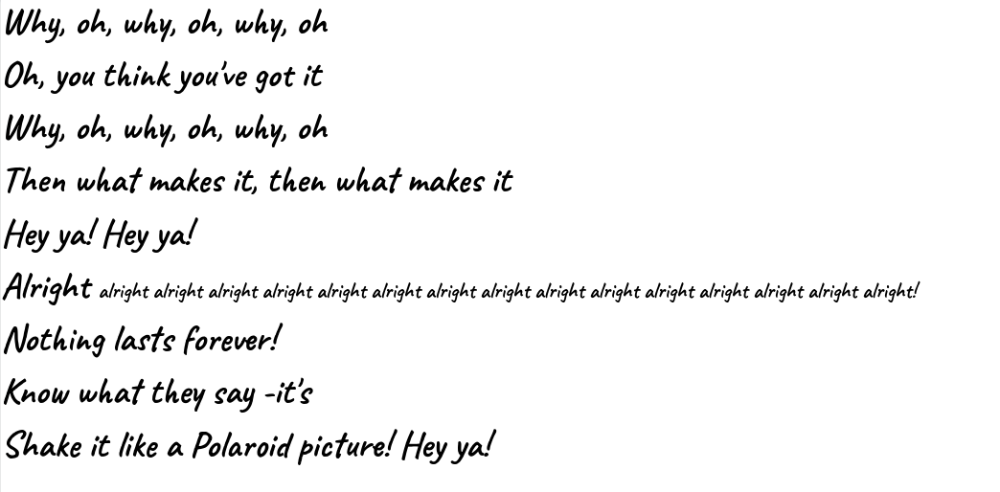

_Note: this description doesnt capture the original challenge question but the revised question with an image over raw text._

#### Solve 
Looking at the song lyrics (any maybe a quick google) shows that its the song "Hey ya" by outkast. Checking the left side of the image we can see that the message reads `WOWTHANKS` by taking the first letter from each line. This is our flag. 

Flag: `WOWTHANKS`

_Rant: This flag had me going down a deep rabbit hole looking up the secret message of the song about toxic relationships in the early 2000's then onto the rhythm count for the song - 11/2, 11/4, 4/4, 4/2, 4/4/4/2/4/4, etc... I now hate this song._

***

### Crypto : Where's the message?
#### Description
What's better than Wireshark? Wirebirds!

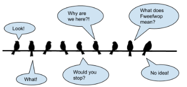

#### Solve 
If you google `birds on a wire cipher` you will get this image (or similar) in the results


From this you can get the flag

Flag: `birdsknow`

***

### Crypto : Baby RSA 0
#### Description
This series will guide you through the wonderful public-key cryptosystem RSA. You might want to stop and read (or more likely, watch) some tutorials first.

Let's start!
RSA actually transforms an integer to another. So how do you make it work with texts/strings? You convert the string to a very long integer. For example,

```
"a" --> 97 (look up ASCII table)
"ab" --> 24930 (256 * 97 + 98)
"abc" --> 6382179 ((256 * 97 + 98) * 256 + 99)
```

Now please convert `fwopCTF{I_am_learning_RSA_so_exciting}` to a very long integer. The flag is its decimal value.

#### Solve 
This one was a simple bit of maths. Using the formula provided we can populate a value `s` with the ord value of the first char in the flagstring then loop over the remaining chars, get their ord values, multiply `s*256` then add that chars ord value. 

```python
#!/usr/bun/env python3

flag = 'fwopCTF{I_am_learning_RSA_so_exciting}'

s = ord(flag[0])

for f in flag[1:]:
	s=(s*256) + ord(f)
	print(f'{f}: {s}')

print()
print('fwopCTF{'+str(s)+'}')
```

Flag: `fwopCTF{13045502302425615144883543017919348302961367754511098998678884785553997741250139993469249405}`

***

### Crypto : Baby RSA 1
#### Description
Now let's do the other way around.

Convert the decimal integer `643192922209641529679217093842090563198908934967463878287741` to a string(which would be our flag).

#### Solve 
This challenges provides an integer `643192922209641529679217093842090563198908934967463878287741`. If we take this and use `Crypto.Util.number.long_to_bytes` we can get the flag

```python
from Crypto.Util.number import long_to_bytes
f = 643192922209641529679217093842090563198908934967463878287741
print( long_to_bytes(f) )
```

Flag: `fwopCTF{another_baby_rsa}`

***

### Crypto : Baby RSA 2
#### Description
Now let's REALLY start with the algorithm. First, we need to select a number n which is the product of two big prime numbers p and q. Let's pick

```
p = 194522226411154500868209046072773892801
q = 288543888189520095825105581859098503663
```

Then `n=?`

#### Solve
This challenge provided 2 primes `p` and `q` and required you to find the modulus (`n`)

```python3 
>>> p = 194522226411154500868209046072773892801
>>> q = 288543888189520095825105581859098503663
>>> p*q
56128199547956677238767298622332803823913995062683233044001500290070667830063
```

Flag: `56128199547956677238767298622332803823913995062683233044001500290070667830063`

***

### Crypto : Baby RSA 3
#### Description
Now we use p and q to calculate a number called totient.

```
p = 194522226411154500868209046072773892801
q = 288543888189520095825105581859098503663
```

`totient = ? ` (answer it in decimal)

#### Solve
Following on from the previous challenge - this challenge required finding `phi`. `phi` is the product of one less of each prime. 

```python
>>> p = 194522226411154500868209046072773892801
>>> q = 288543888189520095825105581859098503663
>>> math.prod([i-1 for i in [p,q]])
56128199547956677238767298622332803823430928948082558447308185662138795433600
```

Flag: `56128199547956677238767298622332803823430928948082558447308185662138795433600`

***

### Crypto : Baby RSA 4
#### Description
Now let's try to encrypt a string with RSA. Other than p and q, you also need an exponent e. Let's say

```
p = 194522226411154500868209046072773892801
q = 288543888189520095825105581859098503663
e = 65537
```

Encrypt `fwop{baby_rsa}` to a long decimal integer with the above parameters.

#### Solve
Following on from the previous challenge - this challenge requires encrypting the provided plaintext `fwop{baby_rsa}`. Using the values from the previous challenge we are able to convert the plaintext to an integer, and raise it to the public exponent `e` modulo `n` (`pow(pt,e,n)`)

```python3
# using variables from previous challenges in series
>>> pt = 'fwop{baby_rsa}'
>>> from Crypto.Util.number import bytes_to_long
>>> pow( bytes_to_long(pt.encode()),e,n)
16832067193038570664627710532871887598013604871431045374089410572330773390687
```

This ciphertext's long format is the flag 

Flag: `16832067193038570664627710532871887598013604871431045374089410572330773390687`

***

### Crypto : Baby RSA 5
#### Description
Now let's find the private key d

```
p = 194522226411154500868209046072773892801
q = 288543888189520095825105581859098503663
e = 65537
```

what is `d`?

#### Solve
Following on from the previous challenge - this challenge requires calculating the private exponent `d` from the details known so far.

This can be achieve by raising `e` to `-1` then modulo `phi`. The below uses `Crypto.Util.number.inverse` but `pow()` can be used too.

```python
>>> p = 194522226411154500868209046072773892801
>>> q = 288543888189520095825105581859098503663
>>> phi = math.prod([i-1 for i in [p,q]])
>>> d = inverse(e,phi)
>>> d
39365191632547732007914614856903809984286421688048990897845086680417895132673
```

Flag: `39365191632547732007914614856903809984286421688048990897845086680417895132673`

### Crypto : Baby RSA 6
#### Description
Now let's decode with RSA

```
p = 194522226411154500868209046072773892801
q = 288543888189520095825105581859098503663
e = 65537
enc = 5052002876272730069345319419734444235143011589416753056749825264763216780757
```

#### Solve
Following on from the previous challenge - this challenge requires using the variables we already have to decrypt a ciphertext (`ct`) provided to us.

Raising the ciphertext's integer representation to the private exponent then modulo the modulus we calculated earlier we can access the plaintext. 

The plaintext can then be converted from integer to bytes with `Crypto.Util.number.long_to_bytes`

```python
>>> ct = 5052002876272730069345319419734444235143011589416753056749825264763216780757
>>> pow(ct,d,n)
46346934476650912220555976350589266330764721503394798425831494985982104649597
>>> long_to_bytes(pow(ct,d,n))
b'fwopCTF{how_many_more_baby_rsa?}'
```

Flag: `fwopCTF{how_many_more_baby_rsa?}`

***

### Crypto : Toddler RSA 
#### Description
Let's do it like a toddler!

Plagiarism? That's the new word I came up with! Don't steal it without crediting me!

```
n = 48564396752059338791464352725210493148212425902751190745668164451763507023284970474595680869078726765719920168392505794415687815488076204724659643390252172928332322944711949999326843460702414647825442748821062427474599006915155109396213406624079900714394311217571510958430682853948004734434233860146109894977 
e = 31337
enc = 41150528980309124566759211353926954600326212451943427970714522842710817302495300068872479882906452508829057279560763667181476082807039520594933172924095664670761580311804814234298908677404942630507776935683606361298186524479302515125123817250737921124161083117345688744816192619093876226182512278538279004036
```

#### Solve
Using the values provided we can factor the primes, derive the private exponent and decrypt the message.

```python
from factordb.factordb import FactorDB
import math

f = FactorDB(n)
f.connect()
primes = f.get_factor_list()
phi = math.prod([p-1 for p in primes])
d = pow(e,-1,phi)
pt = pow(enc,d,n)
(pt).to_bytes(25,byteorder='big')
```

Flag: `fwopCTF{cute_toddler_rsa}`

***

### Crypto : Kinder RSA
#### Description
Oops! I used RSA to encrypt the flag, but I was a bit lazy with the labels and now don't know which number means what!

My teacher in Kindergarten always told me to tidy up.

```
p = 117025919863324186220155912379493510806938956278523335096778026828600895382729413686432125512416987242961255888204400422166767227569280578840187401896714137293001805171341988321852662908122640026581641142465496641866004143100724149516317767459196996302881487013468733667218264219949378827091463411801040433333
e = 65537
c = 3176947916522045759269309860247477806969078544628032431086054916430409561492643390296727934584958799568295039721459221273731800678329151618879869923278910592515839775128584789876977122269445555178438315335177456488472866165828523483080654047393581475909777710523063691395238952705004953255824614927142500947607632610806109942257461826838758244571120945151163127971358262552910600456763503073429250752505495874926777120685874043361508768889445750979867041183999386035611654705651426768594305162794625276466933203875604190503709758422736145157145383125237582611020912918611460533424111536366894528559932701001420239552
n = 10682780633991969177677032196019939027985208229946310919966442519465032181529225488298110788841863113629067354740714072936547257627785850653093685942691560550065001809296374399373377762142325828132422097371522127911728321208614509277335352830189983100178132982012599369846533458595399722731354088854256306846226824731309968110658509633139142049891064431405878186536015671444740708232423766875328640331661803993022425821117080195996399180194864792793387232822578898138983860268605248897408399776140269518083235613918473829364123401722919836036448967473751808918526526887166533489699341809254472381445194313968211679501
d = 8349870118806759862772265655143222556854025841570407203187222760571833826675535585059900898094579214728305769971055714881282836748452480273810581235246886326458027033297324848679391425694502960863074628650323038928823157207551127420106252173985411054925078383258241950659759775646571414573654778240677469493374709546552017058197814263099082949885338486829565261098097424038912450740413892281133896808838467269433631566299466640664843204006072812868977520672537372503857475581013879592069870672135240300086821446969927789617435024923930106366843309026147286983416006068948362159060850750634615509439576603194180447073
q = 91285594221079416032103777163267879510959473929712713487338945167858596955609331062421703786334194408687389318748343117328864181792085064377910816336971021816498260521315839846898184613459752604302179787801085385679518199989894907975205676468500840003987942953430961153503606127238899378811680500145951061497
t =  10682780633991969177677032196019939027985208229946310919966442519465032181529225488298110788841863113629067354740714072936547257627785850653093685942691560550065001809296374399373377762142325828132422097371522127911728321208614509277335352830189983100178132982012599369846533458595399722731354088854256306846018513217225564508406249943596380659573166001197642137951898699448281215894085022126474811032910622341373780614164336656500767770833499149575289014588893739029483794575947420728657552254557876887199414683651891801818601058632300778544925523546053972611657096920266838668977471462066194175542050402021220184672
```

#### Solve
Load these values into python and decrypt

```python
pow(c,d,n).to_bytes(29,byteorder='big')
```

Flag: `fwopCTF{oh_no_my_information}`

***

### Crypto : Elementary RSA
#### Description
I lost a bunch of the RSA data! How do I decrypt the flag now?

```
c = 7547565125898378215297051739440246888835869128178814602128398471744328137846645196352789690502829388481328147506940018807183449257834243707849773598414393305253794845257619586242775698697470314118958662932787038546427248055484396055575105135110971290111917998933205130176836472894218594817189395314880103599436146900262227720584244587872516862458558944038921270858082562381938645818571307807059350434544612575270526939881886666213772988313967785602967403463328683642452412570738638011516486964398202827383201545380219462136633609360170379918362441554815623555045825134255750316711554991895782546314094842951837239221
e = 65537
n= 13715280123196571296040497170215424559841118434271081143085393254503221402455218866367322935884205486745414412072737147619005701422821619176312036264040746835557434946118113454705949958288089469537242690516793314691009138099296393081195700382103932212016949324612763350891225015815072676716589951974500241683728451552619937957018532227780090226646421633572025828452979286761778535053778685371789594887586906300906069495398868677875457680655416855327598433514199221642516967512865226196097662282605095102549022089757838743887028753811567234292303888034615388451343532612361239809487469031081253702053913483627342967513
q= 138295817899027125589939386105258578479159740431881274316292285949477631403445673197617716066873262776020799538878278844875145015704122766147923557098420440559040775768532377541317308499486891858654315671171927898037446605115409768580966408482758441823375862061789309173422687582436899562827562898907601960829
```

#### Solve
This problem required deriving the missing prime by dividing the modulus by the prime that we are given as `q`. 

_Note: you need to use `//` for the division in python to get an integer back as using `int(n/q)` will provide an inaccurate `p` value due to pythons default `floatmax` value._

```python
from Crypto.Util.number import long_to_bytes
# get p from n divided by q (note '//' for int return as too big for floatmax value default)
p = n//q
# calc phi
phi = (p-1)*(q-1)
# calc private exponent
d = pow(e,-1,phi)
# calc plaintext 
pt = pow(c,d,n)
# print plaintext 
print( long_to_bytes(pt))
```

Flag: `fwopCT{don't_be_so_clumsy}`

***

### Crypto : Teenager RSA 
#### Description
So you now know how RSA works now, if you know p, q, e. What if you don't know any of them but just know they are all very small (less than 20). Would that be enough for you to solve this?

```
119, 37, 45, 18, 89, 72, 60, 7, 80, 21, 59, 4, 4, 17, 33, 39, 21, 32, 62, 49, 80, 17, 59, 49, 62, 17, 37, 62, 59, 68, 5
```

(the above are many numbers, not one long number)

#### Solve
This challenge involved bruteforcing the `p`,`q`, and `e` values in the space `0<x<20`.

This is the script that i used for the challenge to get the flag. 

```python
import itertools, math, string
from Crypto.Util.number import inverse,bytes_to_long,long_to_bytes

space = [i for i in range(20)]
cts   = [119, 37, 45, 18, 89, 72, 60, 7, 80, 21, 59, 4, 4, 17, 33, 39, 21, 32, 62, 49, 80, 17, 59, 49, 62, 17, 37, 62, 59, 68, 5]

target_set = string.ascii_lowercase + '{}[].-_'

for perm in list(itertools.product(range(20),repeat=3)):
    try:
        p,q,e = perm
        n=p*q
        phi=math.prod([i-1 for i in [p,q]])
        d = pow(e,-1,phi)
        print(f'[ p={p} | q={q} | e={e} ] -> ',end='')
        for c in cts:
            try:
                pt = long_to_bytes( pow(c,d,n)).decode()
                if pt in target_set:
                    print(pt,end='')
            except:
                pass
        print()
    except:
        pass
```

Running this script and piping through `grep -i fwop` gave the flag twice as the primes are interchangeable.

Flag: `fwop{small_numbers_are_weak}`

***

### Crypto : Thanos RSA
#### Description
This time, Thanos want to eliminate 2/3 of the digits.

So, by now, you probably think the bigger is n, the safer it is. But what if n is so big that actually make RSA weak? Can't it be?

```
n=90853943628322295026593682475987617060873593704720419107522455730118510052263265463293746646770270649687914442326502298395536584315638883283598508714600968672217889495196802078585067900709511094279209391102167066735509213687150809291297894333497926049791571469926970525133534853823359619169977902549379766690271029677550623981924039537745336236460806578804468603462430628647190394537926168276717097453855467142322886378913606046349505735904238841871750986024415032881423400763965392179016644748395748894328459546597234450779143514757379951569086179358016591843479108891552906656123595991984678135372139
e=3
c=353690381812046953967046705467201123771968703796985157143856239677213620452330219172911759040152594421289421265846324253121362172623915294111963396504119782165935747889254103399163563246766329595499703665701197666661
```

#### Solve
This challenge is using a public exponent of 3 therefore we can solve by finding the cube root of the ciphertext

```python
import gmpy2
from Crypto.Util.number import long_to_bytes

## data set here from the challenge description

with gmpy2.local_context(gmpy2.context(), precision=800) as ctx:
        ctx.precision += 800
        root = gmpy2.cbrt(ct)

try:
        print( long_to_bytes( root ) )
except:
        pass
```

Flag: `fwopCTF{small_exponent_is_bad}`

***

### Crypto : Strange RSA
#### Description
This looks like just another RSA. But something is fishy!

```
n=7951018409693161668167285098819306759801615467749983772377532762274564323674475529781135819956076874943220398570628206016160240882619874330243093244936395110045993507712409313429053491882557640392921080389040202564944368311332322835084748219968985945494232530915619964225016803746552927248389191728978163526848645974605789560442463273013903681542284658299342143
p=1929116635275264735053674741049427216734778196597952692885273974756157874848524489523506992386257196915978454424769273897
q=1903374449504601072452320486035709413287524054085898117310656797189766004182623359564618504846582607657952100194953437513
e=65537
c=5966972166891478943697533397002317526062125536151178353483752855912660840768728401988233413928558098251299119103372377488247940263788187179216261221551423070667612264065068718276490178352621443926803409497199336389072678702084464080895190403103597610490385133200289793164066702537822343346786026894342086902097286424450736331498175097265162507503062204219321005
```

***

## Web 

***

### Web : In Front Of Your Eyes
#### Description
My name is hidden somewhere in this webpage. Can you find it?

`https://web.fweefwop.club/in_front_of_ur_eyes.html`

#### Solve
Viewing the source of the website provided the flag

Flag: `fwopCTF{Wolfy_The_Wolf}`

***

### Web : Wacky CSS
#### Description
Kevin just wrote down his opinion on CSS. What font did he write it in? Answer is within fwopCTF{}.

`https://web.fweefwop.club/wacky_css.html`

#### Solve
Similar to the last challenge except the flag is hidden as a comment in the only CSS document included as part of the page provided.

Flag: `fwopCTF{Take_my_hand_to_your_fantasy}`

***

### Web : Robot Invasion
#### Description
I’ve hidden my secret plan for my robot invasion somewhere on this website. I’m not giving you the link, though; you’ll never find out! Muahahahaha!

`https://web.fweefwop.club/robot_invasion.html`

#### Solve
Taking the name of the challenge literally we can assess the `robots.txt` uri location.

```bash
$ curl https://web.fweefwop.club/robots.txt

User-agent: *
Disallow: /
Disallow: /totally_evil_plan
```

Using the bottom disallow link provides the flag

```bash
$ curl https://web.fweefwop.club/totally_evil_plan
```

Flag: `fwopCTF{k1ller_r0bots_wilL_rUl3_th3_W0rld!!1}`

***

### Web : Marq-weeeeeee!
#### Description
Did you know that with the marquee tag, you can make text bounce around the screen? I hid a flag somewhere here.

`https://web.fweefwop.club/weee.html`

#### Solve
The challenge page scrolls the flag hidden in a sea of false flags with bad spelling. Using curl and grep the flag can be revealed due to knowing the flag format of `fwopCTF{`.

```bash
$ curl -sSL https://web.fweefwop.club/weee.html | grep fwopCTF{
        <marquee> fwopCTF{t3f0n00} </marquee>
```

Flag: `fwopCTF{t3f0n00}`

***

### Web : No Inspector
#### Description

`https://web.fweefwop.club/no_inspector.html`

#### Solve
From the provided link there is a single javascript file included with the page. Viewing the contents of the file shows the flag.

Flag: `fwopCTF{funky_0n_4_fr1day_n1ght}`

***

### Web : Complete me
#### Description
For the following SQL statement, I don't remember one particular keyword. Could you find it out for me?

`select username, password from user_table ????? username = 'admin';`

#### Solve
This challenge tests theoretical knowledge of SQL statements. Viewing the statement below to fill in the missing parameter

```sql
select username, password from user_table ????? username = 'admin';
```

Flag: `where`

***

### Web : Cookies
#### Description
Cookie Monster has happened to lock some government secrets within his cookie vault. See if you can get them out!

`https://web.fweefwop.club/cookie.php`

#### Solve
The link given provides a website with a single button. The button makes an XHR request to another URI on the server. Unfortunetly querying this page doesnt provided the flag. 

Clicking on the button `Get Cookies!` provides a message `Sorry, only COOKIE MONSTER has cookies!`.

Reviewing the stored cookies for the website we can see that there is a cookie for `Username` with the value `user`. Changing this value to the information provided `COOKIE MOSTER` provides the flag on next click.

Flag: `fwopCTF{Nom_nom_cookies}`

***

### Web : client side login
#### Description
I've been trying to develop a login system for my website, but I'm scared of all this injection stuff I hear everyone talk about, so I just set up a client side login page instead of hosting a server for it!

[https://web.fweefwop.club/clientside.php](https://web.fweefwop.club/clientside.php)

#### Solve
Inputting the username `admin` or anything else provides nothing back. 

Viewing the source of the page there is a hidden `div` element containing a large amount of possible flags. There is also some javascript that checks the login

```javascript
<script>
            function verify()
            {

                var uname = document.getElementById("input");
                if(uname.value.length == 10 && uname.value.substring(1, 4) == "bef" && uname.value.charCodeAt(8) + 20 == 117){
                    document.getElementById("flag").innerHTML = document.getElementById("text").innerHTML.substring(1080, 1100);
                }else{
                    alert("nay");
                }
            }
        </script>
```

From this we can take `document.getElementById("text").innerHTML.substring(1080, 1100)` and input it into the browser console to display the flag. 

Flag: `fwopCTF{SFOVF5TENW}`

***

### Web : KevinSay
#### Description
I present, Kevinsay, my new and improved rendition of Cowsay. Type anything in and have Kevin say it back to you!

[http://web.fweefwop.club:8401/](http://web.fweefwop.club:8401/)

#### Solve
Inputting text appears to run it through a cowsay-like program then split the output on spaces and provide the first item in the array. 

Using some shell injection techniques we can see that the command appears to be susceptible to shell injection.

Passing `$(id)` provides back `uid=33(www-data)`

Passing `$(ls)` provides `flag193290.txt`

To get the flag we can use

`$(cat flag193290.txt)`

Flag: `fwopCTF{C0MM4ND1NDJ3C710N11}`

***

### Web : weird requests huh
#### Description
Donny the dinosasaurus as created this weird website that requires you make special requests. Any ideas?

`https://web.fweefwop.club/requests.php`

#### Solve
The website provided has a trex image and text above it stating `i love PUTting people down`. Using this information a curl request can be made using a PUT request to the server.

```bash
curl -XPUT https://web.fweefwop.club/requests.php | head -n 1
```

Flag: `fwopCTF{what_does_put_even_do??}`

***

### Web : 53Cr37 8r0W53r
#### Description
We found the landing page a group of Russian spies were using to. See if you're able to get through their security!

`https://web.fweefwop.club/agent.php`

#### Solve
This challenge provides a link to a website with white text on a black background. In the source code there is a commented out section reading `<!-- Agent 014, you will need to reinstall the A3SECRET browser again.  We had to wipe your computer because there were government secrets on it. -->`.

Using this information, a request to the page with the user agent `A3SECRET`

```bash
curl https://web.fweefwop.club/agent.php -H 'user-agent: A3SECRET'
```

Flag: `fwopCTF{secret_browser_007}`

***

### Web : SQLI
#### Description
Try to get into this login system!

`http://web.fweefwop.club:8400/login.php`

#### Solve
This challenge presents users with a login page. Attempting an SQL injection on the site worked with the following injection in the `user` field along with no password.

```sql
' or 1=1 #
```

The flag is the provided once logged in

Flag: `fwopCTF{Leaked_data_123}`

### Web : SQLI but filtered
#### Description
Ok, my old login page wasn't safe at all, and was way too easy to hack. I learned a bit about SQL injections, and have now put a few filters on my page.

[http://web.fweefwop.club:8402/login.php](http://web.fweefwop.club:8402/login.php)

#### Solve
Checking out the page it appears to ask for login details as a username and password form. Checking the robots.txt file there is a _disallow_ for `/filter.php` which when viewing implies the filtered sequences that will be blocked. We can test this by sending something like `or` or `--` in one of the fields and submitting to find its been blocked.

We cant used the payload from the previous challenge as there are 2 conditions  `or` and `#` that are filtered out. 

If we check out some of the common sql injections for auth bypass [https://github.com/payloadbox/sql-injection-payload-list](https://github.com/payloadbox/sql-injection-payload-list) and try `'-'` we are logged in. The final payload after injection looks something like the following

```sql
select username from users where username = ''-'' and password = ''-'';
```

If this query is in a production database it would most likely be returning the first result.

Flag: ``fwopCTF{f1lt3rs_not_good_3n0ugh}

*** 

## Reverse

***

### Reverse : Reversing Python 1
#### Description
Welcome to the Reversing Python series! In these 8 problems, you will be given a python program that asks you for a flag. You will then need to find the correct input that gives you a "Your flag is correct!" output. Once that is done, submit the input you used as the flag.

If you've never seen python before, here is a good tutorial: https://www.learnpython.org/

If you don't want to install python, here is an online compiler. In order to run the files, open them up in a text editor and then past the code into the box that says "main.py". https://www.programiz.com/python-programming/online-compiler/

_Note: All of the Reversing Python problems are made by Happygator. If you have any problems, DM or ping him on the discord._

```python
print("Enter the flag and I will check it for you.")
enteredFlag = input()
if enteredFlag == "fwopCTF{no_python_required}":
    print("Your flag is correct!")
else:
    print("Your flag is incorrect. :(")
```

#### Solve
The python script has the flag in cleartext. viewing the contents of python script with `cat` shows the flag

```bash
cat Reverse1.py
```

Flag: `fwopCTF{no_python_required}`

***

### Reverse : Reversing Python 2
#### Description 
This program uses variables instead of outright telling you the flag.

```python
var1 = "fwopCTF{this_might_be_the_flag}"
var2 = "fwopCTF{this_could_be_the_flag}"
var3 = "fwopCTF{this_potentially_is_the_flag}"
var4 = "fwopCTF{perhaps_this_is_the_flag}"
var5 = "fwopCTF{could_this_be_the_flag?}"
var6 = "fwopCTF{this_probably_isn't_the_flag}"

print("Enter the flag and I will check it for you.")
enteredFlag = input()
if enteredFlag == var4:
    print("Your flag is correct!")
else:
    print("Your flag is incorrect. :(")
```	

#### Solve
Similar to the previous python script, this one has the flag in cleartext in the file. Viewing the file there is a number of flags in the file with some logic to check against the right one. 

```python
# ...
if enteredFlag == var4:
    print("Your flag is correct!")
else:
    print("Your flag is incorrect. :("
```

From this we can take the flag that is set in variable `var4`.

Flag: `fwopCTF{perhaps_this_is_the_flag}`

***

### Reverse : Reversing Python 3 
#### Description
Assigning a variable a value overwrites the previous value.

```python
var1 = "fwopCTF{sheshore_seasore_shells_seasore_shesore_seashells_seashore}"
var3 = "fwopCTF{sheshore_seashore_seesaw_seesaw_shesore_seasore_seasells}"
var2 = "fwopCTF{shesore_seashells_seashells_seasells_shells_seesaw_seasells}"
var1 = "fwopCTF{seashore_see_seashells_shesore_seesaw_sheshore_shells}"
var3 = "fwopCTF{seashells_shells_seasells_seasells_she_shells_see}"
var1 = "fwopCTF{she_seasells_seashore_seashore_seasore_shells_seashore}"
var2 = "fwopCTF{seasore_shells_shells_seashells_sheshore_she_seasells}"
var3 = "fwopCTF{seasore_seesaw_see_seashore_seashells_seashore_seesaw}"
var3 = "fwopCTF{see_seesaw_sheshore_see_sheshore_seasells_shells}"
var1 = "fwopCTF{seashells_she_seasore_seashore_shesore_shesore_seasells}"
var2 = "fwopCTF{seasells_seashells_shesore_seasore_seasore_sheshore_seasore}"
var1 = "fwopCTF{she_seesaw_she_seashore_seasells_she_seesaw}"
var1 = "fwopCTF{she_seashore_shesore_sheshore_sheshore_seesaw_she}"
var2 = "fwopCTF{seasells_she_seasore_she_seashore_seashore_seashells}"
var1 = "fwopCTF{shesore_see_see_seesaw_sheshore_seashells_seashells}"

print("Enter the flag and I will check it for you.")
enteredFlag = input()
if enteredFlag == var3:
    print("Your flag is correct!")
else:
    print("Your flag is incorrect. :(")
```

#### Solve
Similar to the last flag except the same variables are set multiple times. The variable `var3` that we need is the last definition of the variable.

Flag: `fwopCTF{see_seesaw_sheshore_see_sheshore_seasells_shells}`

***

### Reverse : Reversing Python 3 BONUS
#### Description
What a nightmare!

```python3
...snip...
d9ti9 = "fe3a32f7ba09016cca375a64b89375ce"
ggxu = "d4e7fe69eb117cd554d68415fea78bde"
fwfg = "9428349a6583bd23427a9ce1f2e7262f"
po0vm4 = "c466e6cfd82789d2882ab65600e7e2f9"

if enteredFlag == "fwopCTF{" + kaq8h + nw91 + "}":
    print("Your flag is correct!")
else:
    print("Your flag is incorrect. :(") 
```

#### Solve
We can simply print the expected value out as we have all values

```python3
#...snip...
#if enteredFlag == "fwopCTF{" + kaq8h + nw91 + "}":
#    print("Your flag is correct!")
#else:
#    print("Your flag is incorrect. :(") 
print( "fwopCTF{" + kaq8h + nw91 + "}" )
```

Flag: `fwopCTF{a505d061c2baf118fce231d8bfc7c1cbad34ccf7f2ed2c4b8b8c675c235fd744}`

***

### Reverse : Reversing Python 4
#### Description

Introducing: The `if`, `elif`, and `else` statements! These statements require indentation and dictate the flow of a program. 

_Note that "elif" stands for else if, because python is weird._

```python
print("Enter the flag and I will check it for you.")
enteredflag = input()

var1 = 15
var2 = 4
var3 = 9

if var1 < var3:
    var2 = var1 + var3
elif var3 > var2:
    var1 = (var1 * var2) - var2
else:
    var3 = var2 * var1

if var1 - var2 * var3 >= 10:
    var1 = 15 - var3
    var3 = var1 * var2
else:   
    var2 = var1 / var2
    var3 = var3 * 2


if var1 + var2 > var3:
    if var2 + 2 != var1:
        correctflag = "fwopCTF{else_elif_if_elif_else_else}"
    elif var3 - var1 >= var2 * var2:
        correctflag = "fwopCTF{else_if_then_then_else_elif}"
    elif var3 + var1 + var2 <= var3 + var1 * var2:
        correctflag = "fwopCTF{then_else_else_then_if_if}"

var3 = (var3 * -1) + var1 + var2

if var3 + var2 + var1 * 2 >= 0:
    if var3 == var2 * -2:
        correctflag = "fwopCTF{else_then_if_then_elif_elif}"
    elif var2 * var1 - var3 == 3 * var1 + 5 * var2:
        correctflag = "fwopCTF{then_if_then_else_if_if}"
    else:
        correctflag = "fwopCTF{elif_if_if_then_elif_elif}"
        
if enteredflag == correctflag:
    print("Your flag is correct!")
else:
    print("Your flag is incorrect. :(")
```

#### Solve
This code solves the appropriate flag for you as `correctFlag`. So instead of trying to work out the flag we can just replace the last `if/else` statements with a call to print the flag.

```python
# ...
#if enteredflag == correctflag:
#    print("Your flag is correct!")
#else:
#    print("Your flag is incorrect. :(")
print(correctflag)
```

Flag: `fwopCTF{then_if_then_else_if_if}`

***

### Reverse : Reversing Python 5
#### Description
Strings in python can be treated like arrays, meaning you can do lots of things with them.

_Note: use fwopCTF{} format when submitting even if the correct input doesn't contain it._

```python
print("Enter the flag and I will check it for you.")
enteredFlag = input()
correctflag = "deoxyribonucleic_acid"
correctflag = correctflag[0:4] + correctflag[7:16] + correctflag[5:2:-1]
correctflag = correctflag[4:-4] + correctflag[3*4:-1] + correctflag[-1:0:-2]
if enteredFlag == correctflag:
    print("Your flag is correct!")
else:
    print("Your flag is incorrect. :(") 
```

#### Solve
This is the same solution as Reversing Python 4 - remove the last `if/else` statement and replace with a call to print the flag.

```python
# ...
#if enteredFlag == correctflag:
#    print("Your flag is correct!")
#else:
#    print("Your flag is incorrect. :(") 
print(correctflag)
```

Flag: `fwopCTF{bonucleicryxriluoxe}`

***

### Reverse : Reversing Python 6
#### Description
In almost every programming language, arrays are the go-to data type to store large amounts of data.

Once you peel past the python, this is actually a crypto problem :)

```python
print("Enter the flag and I will check it for you.")
enteredFlag = input()
alphabet = "abcdefghijklmnopqrstuvwxyz{}_ABCDEFGHIJKLMNOPQRSTUVWXYZ"
code = [5, 22, 14, 15, 31, 48, 34, 26, 0, 11, 18, 14, 28, 2, 17, 24, 15, 19, 14, 28, 11, 14, 11, 27]
correctflag = ""
for currentNum in code:
    correctflag = correctflag + alphabet[currentNum]

if enteredFlag == correctflag:
    print("Your flag is correct!")
else:
    print("Your flag is incorrect. :(")
```

#### Solve
This is the same solution as Reversing Python 4 - remove the last `if/else` statement and replace with a call to print the flag.

```python
#if enteredFlag == correctflag:
#    print("Your flag is correct!")
#else:
#    print("Your flag is incorrect. :(")
print(correctflag)
```

***

### Reverse : Reversing Python 7
#### Description
Now featuring: the rare for-else statement, a feature that nobody asked for!

_Note: The flag is not fwopCTF{its_time_to_dddduel}, but is instead a mangled version of that._

```python
print("Enter the flag and I will check it for you.")
enteredFlag = input()

semicolonpos = 0
fail = False
if len(enteredFlag) != 20:
    print("Your flag is incorrect. :(")
else:
    enteredFlag = enteredFlag[12:20] + enteredFlag[0:12]
    for i in range(20):
        if enteredFlag[i] == ";":
            semicolonpos = i
        elif enteredFlag[i] == "q":
            break;
    else:
        fail = True
    if not fail:
        enteredFlag = enteredFlag[0:semicolonpos] + "o_dddduel}"
    if enteredFlag == "fwopCTF{its_time_to_dddduel}":
        print("Your flag is correct!")
    else:
        print("Your flag is incorrect. :(") 
```

#### Solve
The code for this can be traced back.

_Comments are inline with code below_

```python
# set flag portion that matters as the 'o_dddduel}' is added later
>>> flag = 'fwopCTF{its_time_t'

# length is 18 - we need 20. This is due to the control commands we are going to use.
>>> len(flag)
18

# assessing the control logic we need to set the 'semicolonpos' and break the for loop
>>> flag += ';q'
>>> flag
'fwopCTF{its_time_t;q'

# now we work backwards from the code provided. It states that we will be splitting after 12 bytes. If we are working back the other way then 20 - 12 is 8 therefore we break our flag on 8 bytes
>>> flag[8:] + flag[:8]
'its_time_t;qfwopCTF{'
```

Flag: `its_time_t;qfwopCTF{`

***

### Reverse : Reversing Python 8
#### Description
_no description..._

```python
print("Enter the flag and I will check it for you.")
enteredFlag = input()
coolarray = [[[], [], []], [[], [], []], [[], [], []]]
if len(enteredFlag) == 27:
    for i in range(3):
        for j in range(3):
            for k in range(3):
              print(i, j, k)
              coolarray[i][j].append(enteredFlag[i*9 + j*3 + k])
    newflag = ""
    for i in [coolarray[2], coolarray[0], coolarray[1]]:
        for j in i[::-1]:
            for k in [j[1], j[2], j[0]]:
                newflag = newflag + k
    if newflag == "s}ginh_td{aFCTpwofolhs_yrar":
        print("Your flag is correct!")
    else:
        print("Your flag is incorrect. :(")
else:
    print("Your flag is incorrect. :(")
```

#### Solve
For this challenge I didnt try reversing the code once I noticed the 3 loops and coolarray being a 3x3 matrix. I instead looked at the comparison flag and saw this same pattern `FCT -> CTF` and `pwo -> wop`. This looks simpler that expected.

Breaking out python I tested out my theory

```python3
# reorder the parts 
unscrambled = [ flag[i+2]+flag[i+0]+flag[i+1] for i in range(0,len(flag),3)]

# get all permutations and join to flag attempt
j = [ ''.join(i) for i in itertools.permutations(unscrambled) ]

# loop over j and check for flag starting with known text value
for i in j:
    if i.startswith('fwopCTF{'):
        print(i)
```

Output

```
...snip...
fwopCTF{arrays_hind_tholgs}
fwopCTF{arrays_hinholgs}d_t
fwopCTF{arrays_hinhold_tgs}
fwopCTF{arrays_d_tgs}hinhol
fwopCTF{arrays_d_tgs}holhin
fwopCTF{arrays_d_things}hol
fwopCTF{arrays_d_thinholgs}
fwopCTF{arrays_d_tholgs}hin
fwopCTF{arrays_d_tholhings}
fwopCTF{arrays_holgs}hind_t
fwopCTF{arrays_holgs}d_thin
fwopCTF{arrays_holhings}d_t
fwopCTF{arrays_holhind_tgs}
fwopCTF{arrays_hold_tgs}hin
fwopCTF{arrays_hold_things}
```

Flag: `fwopCTF{arrays_hold_things}`

***

### Reverse : Fwop Door
#### Description
You can solve this by hand but why?

```python
#!/usr/bin/env python


guess = input('Guess the flag:')
n = [ord(c) for c in guess]

assert(len(n) == 60)
assert(n[9]+n[32]+n[26]== 337)
assert(n[47]+n[14]+n[58]== 329)
assert(n[56]+n[32]+n[19]== 316)
assert(n[32]+n[6]+n[51]== 304)
assert(n[43]+n[14]+n[44]== 318)
assert(n[55]+n[2]+n[50]== 313)
assert(n[36]+n[50]+n[35]== 311)
assert(n[52]+n[42]+n[55]== 311)
assert(n[44]+n[9]+n[22]== 335)
assert(n[57]+n[27]+n[32]== 344)
assert(n[8]+n[33]+n[16]== 322)
assert(n[38]+n[6]+n[26]== 273)
assert(n[53]+n[27]+n[2]== 327)
assert(n[15]+n[35]+n[32]== 328)
assert(n[17]+n[15]+n[21]== 308)
assert(n[28]+n[52]+n[22]== 326)
assert(n[12]+n[53]+n[48]== 317)
assert(n[34]+n[50]+n[6]== 279)
assert(n[22]+n[32]+n[47]== 347)
assert(n[30]+n[32]+n[38]== 333)
assert(n[48]+n[7]+n[59]== 359)
assert(n[40]+n[15]+n[31]== 299)
assert(n[20]+n[30]+n[15]== 304)
assert(n[19]+n[7]+n[13]== 321)
assert(n[54]+n[36]+n[56]== 306)
assert(n[37]+n[10]+n[5]== 284)
assert(n[0]+n[4]+n[6]== 239)
assert(n[41]+n[52]+n[11]== 315)
assert(n[18]+n[42]+n[10]== 315)
assert(n[3]+n[55]+n[34]== 333)
assert(n[27]+n[45]+n[43]== 338)
assert(n[25]+n[51]+n[39]== 321)
assert(n[16]+n[35]+n[4]== 290)
assert(n[4]+n[28]+n[59]== 306)
assert(n[5]+n[44]+n[31]== 295)
assert(n[6]+n[56]+n[58]== 276)
assert(n[14]+n[22]+n[25]== 300)
assert(n[51]+n[4]+n[36]== 284)
assert(n[2]+n[38]+n[5]== 296)
assert(n[11]+n[40]+n[49]== 336)
assert(n[35]+n[38]+n[31]== 317)
assert(n[23]+n[34]+n[5]== 295)
assert(n[1]+n[5]+n[52]== 307)
assert(n[46]+n[26]+n[33]== 298)
assert(n[13]+n[1]+n[23]== 311)
assert(n[49]+n[36]+n[50]== 313)
assert(n[39]+n[25]+n[16]== 313)
assert(n[58]+n[36]+n[18]== 322)
assert(n[31]+n[7]+n[28]== 338)
assert(n[21]+n[35]+n[45]== 333)
assert(n[24]+n[46]+n[33]== 299)
assert(n[29]+n[15]+n[0]== 292)
assert(n[26]+n[5]+n[23]== 283)
assert(n[10]+n[52]+n[39]== 319)
assert(n[7]+n[12]+n[44]== 334)
assert(n[50]+n[27]+n[29]== 301)
assert(n[33]+n[22]+n[43]== 320)
assert(n[45]+n[49]+n[10]== 338)
assert(n[42]+n[58]+n[57]== 326)
assert(n[59]+n[10]+n[12]== 331)
assert(n[18] == 110)

print("You are right!")   
```

#### Solve
This one took me a while to wrap my head around. I first started by trying to brute force, then bruteforce with recursion and `functools.lru_cache` with no luck. 

I was able to build out an empty array of 60 x `0`. 

```python
c = [0]*60
```

Firstly, we know that the flag starts with `fwopCTF{` so we can fill in those array positions with the ordinate values for each chat in that start string. 

Then I parsed the python script to extract the positional indexes for the assert commands and their corresponding value.

Next was to loop over the values and fill out as much of the flag as i could

`fwopCTF{??i??_???ong???a??f???????r??_en??d???????_?h??k???????????????????????????????????????????`

I also had a print statement that would tell me which indexes had been populated

`[0, 1, 2, 3, 4, 5, 6, 7, 10, 13, 17, 18, 19, 23, 26, 34, 37, 38, 39, 42, 50, 52, 55]`

Looking at the above partial flag I tried some statistical analysis and, frankly, guessing to get some further letters. If the letters were not correct then there was a good chance that I would end up with a string in which at least one character was not in the `string.ascii_lowercase + '_{}[]'` charset.

Using this information I started preseeding `c` with previously calculated values and some guesses. 

_The below is completely unmodified from my attempts and solves. It shows some train of thought in the process of solving this flag_

```python
import sys

infile = './input'

lines = []
with open(infile) as fd:
    for line in fd:
        if line.startswith('assert(n'):
            lines.append( line.rstrip() )


c = [0]*60
c = [102, 119, 111, 112, 67, 84, 0, 0, 0, 0, 0, 0, 0, 95, 0, 0, 0, 0, 110, 103, 0, 0, 0, 97, 0, 0, 102, 0, 0, 0, 0, 0, 0, 0, 114, 0, 0, 0, 101, 0, 0, 0, 0, 0, 0, 0, 0, 0, 0, 0, 0, 0, 104, 0, 0, 0, 0, 0, 0, 0, 0, 0, 0, 0, 0, 0, 0, 0, 0, 0, 0, 0, 0, 0, 0, 0, 0, 0, 0, 0, 0, 0, 0, 0, 0, 0, 0, 0, 0, 0, 0, 0, 0, 0, 0, 0, 0, 0, 0]
c = [102, 119, 111, 112, 67, 84, 70, 123, 0, 0, 0, 0, 0, 95, 0, 0, 0, 0, 110, 103, 0, 0, 0, 97, 0, 0, 102, 0, 0, 0, 0, 0, 0, 0, 114, 0, 0, 0, 101, 0, 0, 0, 0, 0, 0, 0, 0, 0, 0, 0, 0, 0, 104, 0, 0, 0, 0, 0, 0, 0, 0, 0, 0, 0, 0, 0, 0, 0, 0, 0, 0, 0, 0, 0, 0, 0, 0, 0, 0, 0, 0, 0, 0, 0, 0, 0, 0, 0, 0, 0, 0, 0, 0, 0, 0, 0, 0, 0, 0]

# c[14]=ord('s')
# c[15]=ord('t')
# c[16]=ord('r')
c[17]=ord('o')
c[51]=ord('t')

from string import ascii_lowercase as lower
import string

lower += '[]()'

def makeFlag(c):
    return ''.join([chr(i) if i != 0 else '?' for i in c])


last=''

def myMain(d):
    global last
    # c[10] = d
    while True:
        angry = 0
        for x in range(len(c)):
            if c[x] == 0:
                angry = x
                break
        if angry == 0:
            print('angry break')
            break

        for line in lines:
            clean = ''
            for char in line:
                if char not in lower:
                    clean += char
            a = clean.split()
            answer = int(a[-1])
            idxs = [ int(i) for i in clean.split('=')[0].split('+') ]
            # print(idxs,answer)
            fail = 0
            fidx = 999
            for idx in idxs:
                # print(idx)
                # # print(c)
                # print(c[idx])
                if c[idx] == 0:
                    fail += 1
                    fidx = idx

            if fail == 1:
                print(fidx)
                print('trying line ', line)
                for idx in idxs:
                    if idx != fidx:
                        answer -= c[idx]
                c[fidx] = answer

        this = makeFlag(c)
        if last == this:
            break
        last = this
        print(this)

        # this = makeFlag(c)
        # if this == last:
        #     fail = False
        #     for x in lower:
        #         cc = c
        #         cc[angry] = ord(x)
        #         ccc = cc if type(cc) == list else [cc]
        #         for char in makeFlag(ccc):
        #             if char not in string.ascii_lowercase:
        #                 fail = True
        #                 break
        #                 continue
        #         print(makeFlag(cc))
        #         c[angry] = x


        # last = this
        # print(this)
        print( [ i for i in range(len(c)) if c[i] != 0 ] )

myMain(0)

# for x in range(60,122):
#     myMain()
```

Which outputs 

```
trying line  assert(n[7]+n[12]+n[44]== 334)
33
trying line  assert(n[33]+n[22]+n[43]== 320)
fwopCTF{?uite_a_long_fla?_for_reverse_eng?dont?y?u_think_so}???????????????????????????????????????
[0, 1, 2, 3, 4, 5, 6, 7, 9, 10, 11, 12, 13, 14, 15, 16, 17, 18, 19, 20, 21, 22, 23, 25, 26, 27, 28, 29, 30, 31, 32, 33, 34, 35, 36, 37, 38, 39, 40, 42, 43, 44, 45, 47, 49, 50, 51, 52, 53, 54, 55, 56, 57, 58, 59]
8
trying line  assert(n[8]+n[33]+n[16]== 322)
48
trying line  assert(n[12]+n[53]+n[48]== 317)
41
trying line  assert(n[41]+n[52]+n[11]== 315)
46
trying line  assert(n[46]+n[26]+n[33]== 298)
24
trying line  assert(n[24]+n[46]+n[33]== 299)
fwopCTF{quite_a_long_flag_for_reverse_eng_dont_you_think_so}???????????????????????????????????????
[0, 1, 2, 3, 4, 5, 6, 7, 8, 9, 10, 11, 12, 13, 14, 15, 16, 17, 18, 19, 20, 21, 22, 23, 24, 25, 26, 27, 28, 29, 30, 31, 32, 33, 34, 35, 36, 37, 38, 39, 40, 41, 42, 43, 44, 45, 46, 47, 48, 49, 50, 51, 52, 53, 54, 55, 56, 57, 58, 59]
```

Flag: `fwopCTF{quite_a_long_flag_for_reverse_eng_dont_you_think_so}`

***

## OSINT

***

### OSINT : A street named what?
#### Description
What's the name of the avenue where this picture was taken?

_Note: If the avenue name is `abc avenue`, then the flag is `fwopCTF{abc}`._


#### Solve
Viewing the image we can see the sign on the left says "Apple Park Visitor Centre". Using google maps to search for that provides the avenue name

Flag: `fwopCTF{pruneridge}`

***

### OSINT : Where is everybody?
#### Description
You woke up one day, it's year 2027. You went around your city and found out the entire city was deserted. No one else was around. You could even walk in to stores to get whatever you want, or go to a police station to drive away a policy car.

What city were you in?

#### Solve
Googling `2027 no humans` provides a news article of a special man that claims to be a time traveller form the year 2027. The videos show no people in the steets of Valencia, Spain.

Flag: `fwopCTF{valencia}`

***

### OSINT : Where is everybody?
#### Description
Kevin visited this island. He told me the island has something to do with "The Rock". I don't think he mean Dwayne Johnson. What's the name of the island anyway?

_Note: if the island name is Xyz island, then the flag is `fwopCTF{xyz}`._


#### Solve
Dropping the image into yandex shows many results for "alcatraz island".

Flag: `fwopCTF{alcatraz}`

***

### OSINT : Location Location Location
#### Description
Our secret agent found the MacGuffin! Her message says

```
x+y = 10.9219612
x-y = -19.712993
```

What city is she in?

#### Solve
Solving the location for `x` as a simultaneous equation.

```
x+y = 10.9219612
x-y = -19.712993
-----------
x = 10.9219612 - y
x = -19.712993 + y
-----------
2x = 10.9219612 - 19.712993 = -8.7910318
-----------
x = -4.3955159
```

Solve for `y`

```
x+y = 10.9219612
y = 10.9219612 - x
y = 10.9219612 - (-4.3955159)
y = 10.9219612 + 4.3955159
y = 15.3174771
```

Using coordinates `-4.3955159, 15.3174771` we land in Kinshasa, Congo

Flag: `fwopCTF{kinshasa}`

***

### OSINT : Lighthouse
#### Description
The super villian is around this light house. What town is he in?


#### Solve
Dropping the image into yandex shows 'Point Pinos Lighthouse'


Searching for that location in google maps brings back 'Pacific Grove'

Flag: `pacific grove`

***

### OSINT : Kevin Gaming
#### Description
Name a gaming console that released in the year Kevin was born. 

[https://twitter.com/TheCoolerKevin_](https://twitter.com/TheCoolerKevin_)

_Note: use fwopCTF{} format and replace spaces with underscores._

#### Solve
Heading over to kevins twitter there is no evidence of his birthday. 


If you follow kevin you can now see his birth year on his profile as '2000'.


Checking out [https://www.thegamer.com/gaming-consoles-handhelds-2000s-ranked/](https://www.thegamer.com/gaming-consoles-handhelds-2000s-ranked/) we are able to see that the `ps2` was released the same year as kevin was born.

Flag: `fwopCTF{ps2}`

***

### OSINT : Kevin Took The Flag
#### Description
Kevin took the flag! Can you go back in time and recover it?

[https://twitter.com/TheCoolerKevin_](https://twitter.com/TheCoolerKevin_)

_Note: ignore the part about Extra #1_

#### Solve
Heading over to kevins twitter there is no evidence of the flag. The challenge mentions going back in time so we check out waybackmachine.

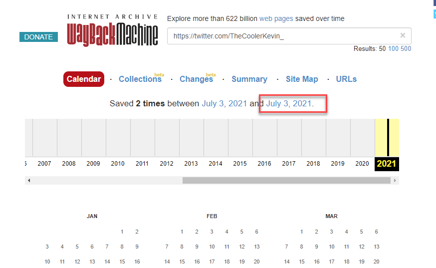

Clicking on the highlighted link takes you to an archived version of kevins twitter page which has a flag in a tweet. 

[Permalink](http://web.archive.org/web/20210703174210/https://twitter.com/TheCoolerKevin_)

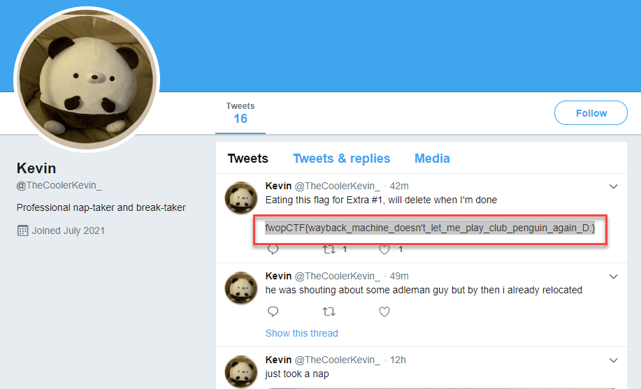


Flag: `fwopCTF{wayback_machine_doesn't_let_me_play_club_penguin_again_D:}`

***

### OSINT : Kevin's secret
#### Description
Kevin, our team mascot, has been hiding something from us. I thought I saw something on his Github page( [https://github.com/fweefwopkevin](https://github.com/fweefwopkevin) ) , but it disapeared before I could look at it. Can you find it for me?

#### Solve
Heading over to kevins github repository `fweefwopkevin` he appears to have a single repository; a fork of [hampusborgos/country-flags](hampusborgos/country-flags) with the same name. Viewing the repository there is mention of a commit 'redacting' a 'flag'. 

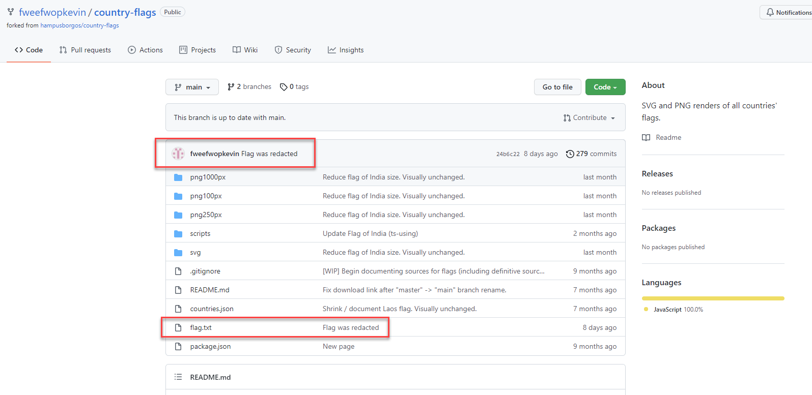

Clicking on the commit name takes you to the difference of the changes from the previous commit to that commit in which you can see the flag. 

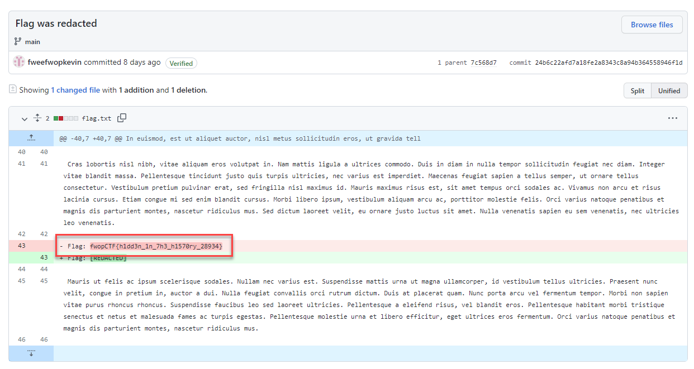


Flag: `fwopCTF{h1dd3n_1n_7h3_h1570ry_28934}`

***

### OSINT : Bitcoin Laundering (2)
#### Description
_note: This is following on from the `bitcoin laundering` challenges under forensics_

This is again about the the Bitcoin address 16ftSEQ4ctQFDtVZiUBusQUjRrGhM3JYwe. Guess what? It's a reall address (All addresses in the log file are real with a lot of Bitcoins in them. The trsactions were made up though.)

On Nov 21, 2018 6:21 AM (UTC), this address( 16ftSEQ4ctQFDtVZiUBusQUjRrGhM3JYwe) sent 8,888 BTC to another address that starts wtih 3M. That's big money. Now we are curious about this 3M address.

What is the amount of the largest single transaction this 3M address received this year so far (1/1/2021 to 10/25/2021)?

#### Solve
This challenge follows on from the previous in the series but this time away from the forensics category. 

Looking through `blockchain.com`'s records of the address in questions and searching for the address starting with `3M` we find it on page 5

`https://www.blockchain.com/btc/address/16ftSEQ4ctQFDtVZiUBusQUjRrGhM3JYwe?page=5`

The full address in questions is `3M219KR5vEneNb47ewrPfWyb5jQ2DjxRP6`

Moving on we use the `chain.so` API to pull all transactions for the wallet in question.

```bash
wget "https://chain.so/api/v2/address/BTC/3M219KR5vEneNb47ewrPfWyb5jQ2DjxRP6" -O 3M219KR5vEneNb47ewrPfWyb5jQ2DjxRP6.json
```

We can then use a python script to get the largest deposit

```python
# import required libraries 
import json

# name of file saved with wget previously
filename = './3M219KR5vEneNb47ewrPfWyb5jQ2DjxRP6.json'

# load in data
data = json.load(open(filename))

# move down data to transactions as thats all we care about 
data = data['data']['txs']

# place to hold deposit values
deposits = []

# loop over transactions and add deposit values to deposits variable 
for transaction in data:
	if 'incoming' in transaction.keys():
		# convert string value to float and add item to deposits
		deposits.append( float(transaction['incoming']['value']) )
		
# find the max of the deposits list and print 
print( max(deposits) )
```

This can also be done in a single line with `requests` added in

```python
max( [ float(v['incoming']['value']) for v in requests.get('https://chain.so/api/v2/address/BTC/3M219KR5vEneNb47ewrP
fWyb5jQ2DjxRP6').json()['data']['txs'] if 'incoming' in v.keys() ] )
```

Flag: `30888`

***


