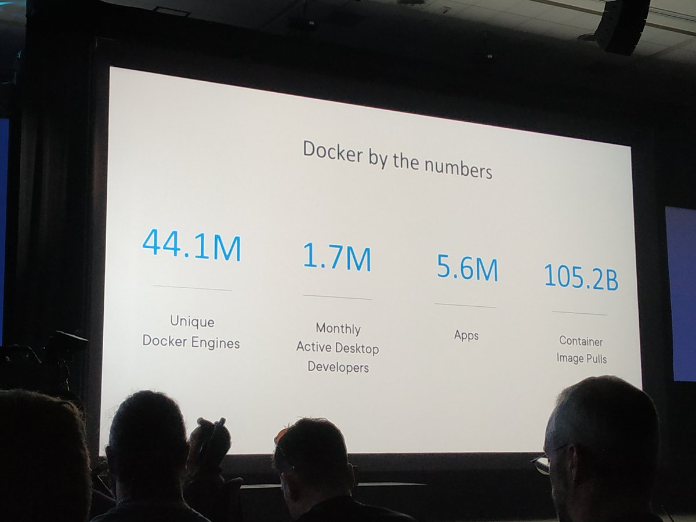
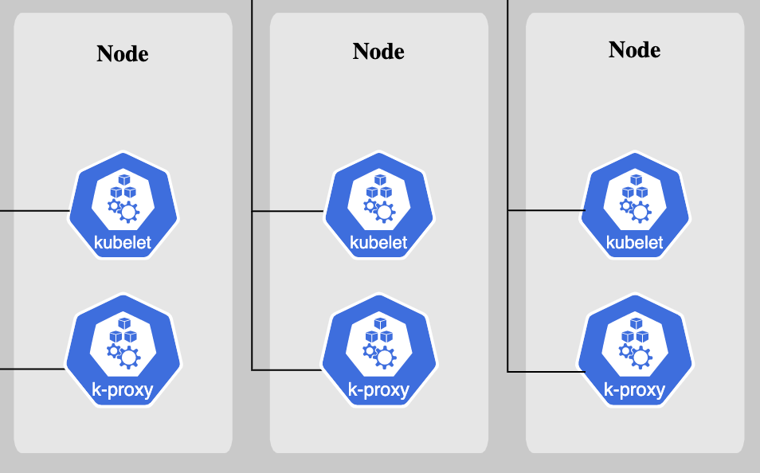

# Kubernetes

❗ Kubernetes에 관련된 글을 작성하지만 해당 글이 모두 맞다는 것은 아닙니다. <br>
❗ 틀린 부분은 연락주시면 새롭게 고칠 수 있도록 하겠습니다 :) <br>
❗ 또한 이 글에서 다양하고 세세하게 다루기는 힘들 정도에 분량인 주제입니다. <br>
❗ 그렇기에 다양하고 자세하게 알고싶다면 Kubernetes 공식 사이트를 확인해주시기 바랍니다 :) <br>

## Intro
1. [What is Kubernetes ?]()
2. [Kubernetes Component]()
    - Cluster 
    - node 
    - Pod 
3. [Kubernetes Term]()

<hr>
<br>

## 참고글
[Kubernetes Official Docs Page](https://kubernetes.io/ko/docs/home/)
<hr>
<br>

# Kubernetes


<br>

## What is Kubernetes ?
Kubernetes는 Container를 ```간단하고 빠르게 배포 및 확장하고 자동화```를 통하여 ```관리```를 해주는 Open Source 플랫폼이다.

❗쓸모없어보이지만 알아두면 쓸모가 생기는 Kubernetes 수식어 <br>
- Helmsman(조타수) <br>
- k8s <br>
- kube <br>

```Docker```는 2013년에 등장하여 현재는 인프라 세계를 Container를 통한 인프라 세상으로 바꿨다. <br>
전세계 사람들이 수많은 솔루션들을 Container로 배포하고 ```Dockerfile```을 작성하여 이미지를 빌드하여 컨테이너를 배포하는게 흔해진 세상이다.

여기서 한가지 궁금증이 생길 수 있다. <br>
Q. 그 많은 사람들이 써봐야 얼마나 쓴다고 Docker가 인프라 세계를 Container를 통한 인프라 세상으로 바꿔 ?


위 사진은 2019년 기준입니다. <br>
사진에서도 볼 수 있듯이 Docker는 무려 1052억번의 Container Image Pull이 발생했다고 밝혔다. <br>
그 만큼 Docker에 인기가 올라갈수록 Kubernetes의 인기 또한 계속해서 올라갔다. <br>

<hr>
<br>

## Kubernetes Component

<center> Sources : Kubernetes Official Page </center> <br>

Kubernetes 를 배포하게 되면 Cluster를 얻는다. <br>
Kubernetes Cluster는 컨테이너화된 Application을 실행할 수 있는 ```node```라고 불리고있는 ```Worker Machine```으로 구성된다.. <br>
각 Cluster에는 적어도 하나의 ```Worker node```가 있다. <br>

<br>

```Worker node```는 Application의 구성요소인 ```Pods```를 호스트합니다. <br>
```Control Plane```은 Cluster 내에 존재하는 Worker node와 Pods를 관리한다.

<hr>
<br>

### 2-1 Cluster 
Kubernetes 내 ```가장 큰 단위```로, 여러 리소스를 관리하기 위한 집합체를 말한다 <br>
좀 더 쉽게 설명하면 가상 Server들이 속한 클라우드를 뜻한다. <br>

<hr>
<br>

### 2-2 node 
<center></center> <br>
node란 Cluster 내 가상 서버를 뜻한다. <br>
즉 컴퓨팅 엔진 단위라고 이해하면 쉽다. <br>
<br>

Cluster 다음으로 큰 단위며, ```Master node```와 ```Worker node``` 총 2가지로 분리되어있다.

❗Master node와 Worker node가 뭐야 ?
1. Master node : Kubernetes 전체 시스템을 관리, 통제할 수 있는 노드를 의미<br>
2. Worker node : 모두 다른 목적과 기능으로 나눠진 컨테이너들이 실제 배치되는 노드를 의미<br>
<hr>
<br>

### 2-3 Pod
Pod은 Container가 모인 집합체의 단위로 적어도 하나 이상의 Container로 이루어진다. <br>
또한 Kubernetes 내 ```가장 작은 단위```이다. <br>
리소스를 더 지능적으로 사용할 수 있도록 Container를 Pod로 ```그룹화```시킨다.

❗정리를 해보면 다음과 Kubernetes는 다음과 같은 크기 단위를 가지고 있다.
```cs
Cluster -> node -> Pod -> Container
```

<hr>
<br>

## Kubernetes Term
Kubernetes에는 여러가지 용어들이 존재한다. <br>
글에 처음 부분에서 말했던 것처럼 이 글에서는 모두 정리하기는 힘들다. <br>
❗ 그렇기에 좀 더 정확하고 다양한 내용은 Kubernetes 공식 사이트에서 확인하기 바란다. <br>

### 1. worker
- 실제 Container들이 생성되어 일을 하는 node다.
- 예전에는 ```minion```이라는 이름을 가졌었다.
<br>

### 2. yaml
- service, rc 등 기능을 설명해놓은 데이터 형식 코드이다.
<br>

### 3. rc
- replication controller의 줄임말이다.
- pod을 자동으로 생성 및 복제해주는 Controller이다.

### 4. QoS Class
- Kubernetes가 Cluster 안의 Pod들을 여러 Class로 구성하고 <br>
Scheduling과 Eviction에 대한 결정을 내리는 방법을 제공한다.

그 외에 용어들은 [Kubernetes Official Page | Glossary](https://kubernetes.io/docs/reference/glossary/?fundamental=true)에서 확인할 수 있다.

<hr>
<br>

